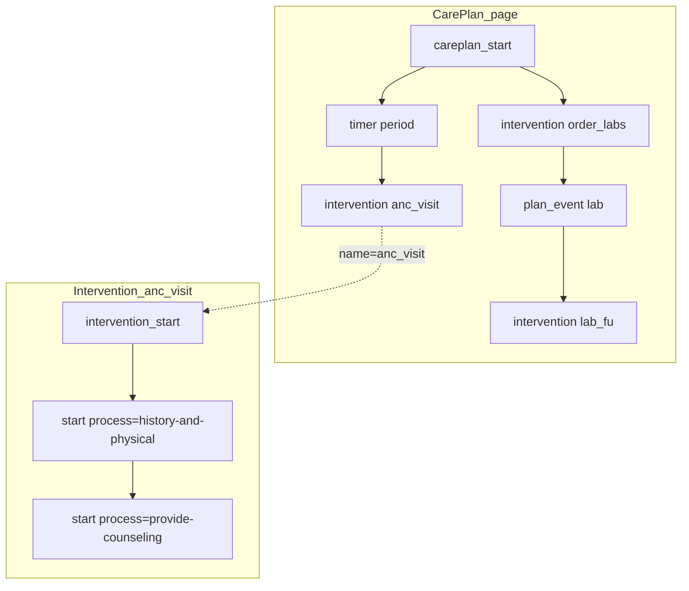

# CarePlan Orchestration Layer — Feature Specification

| Field | Value |
|-------|-------|
| **Status** | Draft |
| **Branch target** | TBD (design discussion only — no implementation branch yet) |
| **Related** | `feature/carePlan.md` (user's own draft — merged into this document, see §0), `docs/open-srp-export.md`, `feature/careplan-intervention-plandefinition.md` (Implemented — process-level nesting), `docs/desing/FHIRcore.md`, `docs/tricc-elements.md`, `docs/visual-authoring-concepts.md` |
| **Authoring surface** | draw.io (new node types), YAML fixtures (for future tests) |

Valid status values: `Draft` → `Approved` → `Implemented` → `Superseded`.

---

## 0. Status of this merge (2026-08-11)

This document was drafted independently from `feature/carePlan.md` (the user's own working
placeholder) "while the same feature [was] explored independently with several models for
comparison." Per request, this document now **merges** `feature/carePlan.md`'s content in —
its worked examples, node-type catalogue, edge grammar, validation rules, YAML shape, and
already-made "open decisions" are folded in below, clearly attributed to their source wherever
the two drafts propose **different mechanisms** for the same problem.

**`feature/carePlan.md` is left in place, unchanged, as the source record** — it is not deleted
or marked Superseded yet. See **§12 (Inconsistencies to resolve)** for the full analysis; **§0.1
below records the resolutions the user gave on 2026-08-11.** Once any remaining loose ends
(flagged in §0.1) are tied up, the rejected alternative(s) should be deleted from this document
(not just left as a fork) and `feature/carePlan.md` can be marked `Superseded` in favour of
this file.

### 0.1 Resolutions (2026-08-11)

| Question (§12) | Resolution | Notes |
|---|---|---|
| **Q1** — Intervention reuse | **Reusable — but refined.** User's words: *"reusable in the sense that it wrap a list of process instance together (it may have several registration process definition but the instance might pick only one, other likely used in other intervention)."* This is **not** simply "adopt carePlan.md's call-node model verbatim" — the more important axis of reuse is at the **Process** level, not just the Intervention level. See the new §3.2a below. **This still leaves one mechanic unconfirmed:** exactly how a process instance is named/referenced so an Intervention can "pick" one — flagged for follow-up, not blocking. |
| **Q2** — Scheduling shape | **`schedule` connector (this draft), not `timer`/`plan_event`.** §14.2's split node types and §15's edge-label grammar are **not adopted** — kept below only as historical reference. |
| **Q3** — Offset anchor | **Explicit `from: complete\|start` attribute (carePlan.md), adopted onto the `schedule` node** (not onto a separate `timer` node, since Q2 rejected that node type) — default `complete`. See updated §14.1. |
| Q4 (derivative) | **Leans toward a named-catalog project model** (§19's "carePlan.md" option), because Q1's resolution requires *some* lookup mechanism for shared process instances even though full Intervention-by-name reuse across CarePlans wasn't the primary point. Not fully locked — see §19. |

Both source drafts already agree on the following, so these are **not** open questions:

- The four-level hierarchy `Project → CarePlan(s) → Intervention(s) → Process(es)` (§2.1).
- A project may have **zero** CarePlans (today's behaviour, fully backward compatible) or
  **more than one**, each evaluated independently.
- Only **Interventions** are schedulable — a `schedule`/`timer` can target an Intervention's
  start, never a Process inside an already-running Intervention (fine-grained scheduling is
  out of scope for v1).
- CarePlan-level authoring reuses the existing relevance/rhombus vocabulary — no new
  expression language.
- This is authoring/design work only — no code changes until Approved.

---

# Part I — Business Description

*Audience: clinical authors, guideline developers, implementers evaluating TRICC workflows.*

## 1. Overview

Today, a TRICC draw.io project models **one continuous intervention made of several processes**:
Registration → Triage → Clinical Assessment → Guideline-based Care → Dispense Medications, etc.
Each process is a page/tab; they run once, in a fixed order, in a single encounter.

Many real-world care programs need more than that: a **CarePlan** that schedules and
supervises **several interventions over time** — not just one encounter. For example:

- A **6-month nutrition follow-up**: the same "monthly weight check" intervention recurs
  once a month, six times.
- A **danger-sign follow-up call** that must happen **3 days after** the initial visit
  intervention is submitted — but only if that visit flagged a risk.
- A **lab-result review** intervention that starts whenever a lab result event arrives,
  independent of any fixed date.
- A **starter intervention** that is simply due immediately when the CarePlan itself applies
  (e.g. the initial visit, as soon as the patient is enrolled).

This spec proposes a new **CarePlan** authoring layer, drawn in draw.io, that sits **above**
today's intervention and lets authors declare several interventions and the rules that decide
when each one becomes due.

### 1.1 Clinical problem catalogue *(from `feature/carePlan.md` §2)*

Examples that are awkward or impossible as a single multi-process form:

| Need | Example |
|------|---------|
| Fixed calendar of visits | ANC: one visit every month for 6 months |
| Dependent follow-up | Counseling due 3 days after assessment is submitted (or immediately) |
| Event-driven care | Anemia follow-up only after hemoglobin result is available |
| Mixed pathway | Intake now + monthly visits + lab-triggered branch + discharge review |
| Enrollment rules | Start pathway only if pregnant / under-5 / high-risk |
| Per-visit applicability | Intensive package only if risk flag is true when the trigger fires |

Without a CarePlan layer, authors either flatten everything into one huge form, duplicate
process graphs per visit, or push scheduling into the runtime app with no guideline-level
diagram.

## 2. Vocabulary

| Term | Today | Proposed |
|------|-------|----------|
| **Process** | One page/tab (Registration, Triage, …), chained in a fixed order within one encounter | Unchanged — still one page/tab |
| **Intervention** | Implicit: the *entire* project is one intervention (all processes chained together) | Explicit: one self-contained chain of processes (what the whole project is today), given a name and its own start point |
| **CarePlan** | Does not exist | New: orchestrates several Interventions — decides when each becomes due, and whether the plan applies at all. **A project may contain more than one CarePlan** (see §2.1), the same way a CarePlan may contain more than one Intervention |

An existing single-intervention project is the **degenerate case** of a CarePlan with exactly
one intervention that is immediately due — nothing about how a single intervention's processes
work today needs to change.

### 2.1 Concept structure

This feature adds two new levels above today's Process; nothing below Process changes:

```
Project
 └── CarePlan(s)           ← NEW — pathway over time
      └── Intervention(s)  ← NEW — schedulable unit of care
           └── Process(es) ← EXISTING — cpg-common-process segments
                └── Activities / questions / logic
```

- **Project** may declare **zero or more CarePlans**. Zero CarePlans is today's status quo (a
  project is exactly one Intervention, exactly one chain of Processes — see §6's backward-
  compatibility note). More than one CarePlan lets a single project bundle independent care
  pathways (e.g. a "nutrition follow-up" CarePlan and an unrelated "TB follow-up" CarePlan in
  the same project) that apply and schedule **independently** of one another — same relationship
  a CarePlan has to its own Interventions, one level down.
- Each **CarePlan** may declare **one or more Interventions** (§3.2), each with its own
  applicability and scheduling (§3.3).
- Each **Intervention** is, unchanged, a chain of one or more **Processes** (today's page/tab
  chaining via `goto`/`link_in`/`link_out`).
- Each **Process** is, unchanged, the existing chain of Activities/questions/logic that compiles
  to one Questionnaire (see `docs/open-srp-export.md`). Since 2026-08-11, each **Intervention**
  also compiles to one shared PlanDefinition with one nested `action` per Process — see
  `feature/careplan-intervention-plandefinition.md` (**Implemented**) and §26 below.

## 3. What authors draw

> **✅ Resolved 2026-08-11.** §3 (3.1–3.4) below is the **adopted** model — a single polymorphic
> `schedule` connector, Interventions drawn inline (refined by §3.2a for process-instance
> reuse). `feature/carePlan.md`'s alternative (separate Intervention pages referenced by a call
> node, plus distinct `timer` / `plan_event` node types, §3.5–3.6) was considered and **not
> adopted** — see §12 for the full trade-off record.

### 3.1 CarePlan start

A CarePlan is anchored by one **CarePlan start** node — visually a start-event circle,
distinguishable from an ordinary intervention start (different fill colour). It carries:

- a **name** and **title** for the CarePlan,
- an optional **relevance** condition: does this CarePlan apply to this patient at all?
  (e.g. "only for children under 5", "only for confirmed-pregnant patients"). If omitted, the
  CarePlan always applies.

**A project may contain more than one CarePlan start node** — each one roots its own
independent CarePlan, with its own name, title, relevance, and set of Interventions/schedule
connectors underneath it (see §2.1). CarePlans in the same project do not interact with or
gate one another; each is evaluated on its own. `name` must be unique **per project** across
all CarePlan start nodes, the same uniqueness requirement Intervention `start` nodes already
have within one CarePlan — it feeds the canonical/id conventions in
`docs/open-srp-export.md` one level up (see §18).

### 3.2 Interventions

Each Intervention keeps today's **start** node (the same shape authors already use to begin a
process chain) as its entry point. What changes is that a project can now have **more than
one** of these, each one representing a separate Intervention, each with its own name and its
own optional **relevance** condition (does *this* intervention apply, given everything known
about the patient so far — for example "only if the initial visit flagged malnutrition risk").

Internally, an Intervention is exactly what a whole project is today: a chain of processes
linked by `goto` / `link_in` / `link_out`, unchanged.

**Superseded by §3.2a below (resolved 2026-08-11):** this note originally said Interventions
have no cross-CarePlan reuse. The user's answer to §12 Q1 says otherwise — see §3.2a.

### 3.2a Process-instance reuse (resolved 2026-08-11)

An Intervention is best understood as **a named wrapper around a list of process instances**,
not a fixed, privately-owned chain. Concretely, from the user's own framing:

> "it may have several registration process definitions but the instance might pick only one,
> other likely used in other intervention"

That is: a project can author **more than one distinct instance of the same process type**
(e.g. two different `registration` tabs — say a "quick registration" and a "full registration"
— both typed `process=registration`). An Intervention is composed by **picking specific
process instances** into itself, and the **same process instance can be picked by more than
one Intervention** — reuse happens at the Process layer, not only (or even primarily) at the
Intervention layer.

This also retroactively clarifies the terse, previously-flagged §14.2 "process instances" row
carried over from `feature/carePlan.md` §4.2 ("map which process intervention belong to the
intervention... require only once of an intervention, will be duplicated if intervention is
triggered at several places"): a process instance is **authored once** (one tab/definition);
Interventions reference it by whatever stable id it carries; and if an Intervention (and the
process instances it wraps) is **triggered from more than one place** (e.g. called from two
different points in one CarePlan, or from two different CarePlans), each trigger produces its
**own runtime data instance** — the definition is shared, the data is not.

**Still open (not blocking, needs one more pass before Approved):** the exact attribute/mechanism
an Intervention uses to "pick" a process instance — e.g. a stable `instance` or
`process_instance` name on the process `start` node, distinct from its `process` type name, that
an Intervention's composition list references. Neither source draft specifies this at the
attribute level yet.

### 3.3 Scheduling — the `schedule` connector

Between the CarePlan start (or between one Intervention and another) and an Intervention's
start node, authors place a new **schedule** connector — a small event marker on the arrow,
using the same visual family as today's process start/end markers (a clock face for
time-based scheduling, an envelope for event-based scheduling). It declares **one** of four
modes:

| Mode | Meaning | Author fills in | Maps to the user's scenario |
|------|---------|------------------|------------------------------|
| **Immediate** *(default)* | Due as soon as the source (CarePlan or prior intervention) is applicable — no `schedule` connector needed at all, just draw a plain arrow | *(nothing)* | "can be directly due" |
| **Periodic** | Recurs on a fixed cadence, a fixed number of times | recurrence period (e.g. every month) + number of repeats (e.g. 6) | "one every month for 6 months" |
| **Offset** | Due a fixed time after another intervention reaches a milestone | delay (e.g. 3 days) + which intervention + which milestone (submitted / completed / due) | "intervention A follows X days after intervention B is submitted" |
| **Event** | Due when a named external event occurs | event name (e.g. "lab result available") | "after a given task/event (e.g. lab result)" |

A `schedule` connector may also carry its own extra relevance condition, for cases where the
timing rule alone isn't enough (e.g. "3 days after submission, **and only if** risk was flagged").

### 3.4 Worked example (this draft's model)

A 6-month malnutrition follow-up CarePlan:

```
                        ┌─────────────────────┐
                        │   CarePlan start     │  relevance: age < 5 and malnutrition_risk
                        │  "nutrition-followup"│
                        └──────────┬───────────┘
                                   │
                     ┌─────────────┼───────────────────────────┐
                     │ immediate   │ periodic                  │ event
                     ▼             ▼ every 1 month, ×6         ▼ "lab-result-available"
              ┌─────────────┐ ┌─────────────────┐      ┌───────────────────┐
              │ Intervention│ │  Intervention    │      │   Intervention    │
              │"initial-    │ │"monthly-weight-  │      │  "lab-review"     │
              │ visit"      │ │  check"          │      │                   │
              └──────┬──────┘ └──────────────────┘      └───────────────────┘
                     │ (submitted)
                     │ offset: 3 days, anchor=submitted
                     │ relevance: danger_sign_flagged
                     ▼
              ┌─────────────────────┐
              │   Intervention      │
              │ "danger-sign-call"  │
              └─────────────────────┘
```

Each of the four boxes on the second row is an ordinary intervention start — internally it
looks exactly like today's single-intervention diagrams. Only the CarePlan start and the four
`schedule` connectors are new.

### 3.5 Rejected alternative authoring model *(from `feature/carePlan.md`, kept for reference only)*

**Resolved 2026-08-11 — not adopted:** §12 Q2 was decided in favour of the single `schedule`
connector (§3.3), not the `timer`/`plan_event` split node types described below. The
**page-kind split (CarePlan/Intervention/Process as separate tabs)** and **call-by-name
reference** described here are also not adopted as originally framed — but they partially
informed the process-instance reuse concept now captured in §3.2a. Kept below for historical
context only; do not treat as current design.

`feature/carePlan.md` proposes **three distinct draw.io page kinds** (tabs) instead of drawing
everything on one CarePlan page:

| Page kind | Root shape | What you draw there |
|-----------|------------|---------------------|
| **CarePlan** | CarePlan start | Orchestration only: which interventions start, timers, events, conditions — **no clinical questions** |
| **Intervention** | Intervention start | Which **processes** instance make up this package (overview / links) |
| **Process / activity** | Process start or activity start | **Unchanged** clinical flowchart |

Suggested tab naming: CarePlan `cp_<name>` (e.g. `cp_anc_pathway`), Intervention `iv_<name>`
(e.g. `iv_anc_visit`), Process/activity unchanged.

Instead of drawing Intervention boxes directly on the CarePlan page (§3.2), the CarePlan page
places an **Intervention call node** — a rounded rectangle with a **double border** (BPMN call
activity) — referencing an Intervention **by name**, where the named Intervention is defined
once on its own page (`intervention_start`) and can be **called from more than one CarePlan**.
This is the mechanism behind `feature/carePlan.md`'s open decision "reuse intervention across
CarePlans: **Yes** (by name)" (§10 below) — something §3.2's inline model cannot do.

Scheduling is split into two dedicated node types instead of one polymorphic connector:

| Shape | Role | Typical look |
|-------|------|--------------|
| **Timer** | Delay or repeating schedule (`offset`, `period`, `count`, `until`, `from: complete\|start`) | Circle with clock (BPMN timer) |
| **Plan event** | Wait for lab / task / system event (`event`, `reference`) | Message or signal intermediate event |
| **CarePlan end** | Optional pathway completion | End event |
| **Rhombus / bridge** | Conditions and merges — **same as today** | Existing shapes |

A `timer`'s `from` attribute (`complete` default, or `start`) makes the offset anchor
**explicit per-timer** — see §16 for how this answers this draft's open question in §9.2.

Full node-type catalogue, attributes, and edge-label grammar are in Part II §14–§15.

### 3.6 Worked examples under the (rejected) `carePlan.md` model — historical reference only

**Monthly ANC-style visits** — CarePlan page:

```text
[CarePlan start: anc_pathway]
        │
        ▼
[Timer: period=P1M, count=6]
        │
        ▼
[Intervention call: anc_visit — "ANC visit"]
```

Intervention page (`anc_visit`, its own tab):

```text
[Intervention start: anc_visit]
        │
        ├──► process start  process=history-and-physical
        ├──► process start  process=diagnostic-testing
        └──► process start  process=provide-counseling
```

Clinical questions stay on the process/activity tabs for those processes, exactly as today.

**B follows A by three days (or immediately):**

```text
[CarePlan start] → [Intervention: assessment] --(+P3D)--> [Intervention: counseling]
```

Immediate after submit: `assessment ── due ──► counseling`.

**Lab event and condition:**

```text
[CarePlan start] → [Intervention: order_labs] → [Plan event: lab_result / hemoglobin]
                                                        │
                                          yes ◄─ [Rhombus: hb_low?] ─► no
                                           │                           │
                                           ▼                           ▼
                                        [treat]              [CarePlan end / stop]
```

## 4. What authors must **not** put on a CarePlan page *(from `feature/carePlan.md` §6)*

Regardless of which authoring model (§3.1–3.4 vs §3.5–3.6) is chosen, both drafts agree a
CarePlan page is **not** a form:

- Clinical questions (`select_*`, integer, text, …)
- Full activity flowcharts

CarePlan pages stay readable as **pathway diagrams**. Clinical logic remains on process/activity
pages.

## 5. Benefits *(from `feature/carePlan.md` §7)*

- Guideline-level **planning** is visible in the same file as clinical logic.
- Reuses BPMN-like habits authors already know (starts, gates, timers, calls).
- Process instances can be **reused** across Interventions (resolved 2026-08-11, §3.2a) — an
  Intervention is a named wrapper around a picked set of process instances, and the same
  process instance may be picked by more than one Intervention.
- Multiple CarePlans can coexist (different enrollment relevance).
- Projects without a CarePlan page keep **today's behaviour** (implicit single intervention).

## 6. What this does **not** do (v1 scope)

- No branching/parallel scheduling logic beyond the four modes above (no cron expressions, no
  "every 2nd Monday", no calendar-aware scheduling).
- No change to how a single Intervention's internal processes are authored, linked, or
  converted — `goto`, `link_in`/`link_out`, `rhombus`, `wait`, `factor`, `repeat` all keep
  working exactly as documented in `docs/tricc-elements.md`.
- No runtime behaviour is specified here (who actually evaluates "3 days later" and creates the
  next Task/Questionnaire at runtime is a FHIR-Core/OpenSRP concern — see Part II, §18).
- A single project may still have exactly one Intervention and no CarePlan start at all — fully
  backward compatible with every existing diagram.
- No cross-CarePlan logic: when a project has more than one CarePlan (§2.1), each is applied,
  scheduled, and evaluated **independently** — no shared state, no ordering, no relevance
  condition may reference across a CarePlan boundary. Coordinating two CarePlans against each
  other is out of scope for this pass.
- **Design only** *(from `feature/carePlan.md` §8)* — no conversion, validation engine, or
  OpenSRP/FHIR CarePlan export until a later implementation phase (§23).
- Exact runtime meaning of "intervention submitted" (all processes done vs explicit end) is
  deferred to implementation; authors should draw a clear end of the intervention package
  (see §9.2 / §16).
- Recurrence "calendar month vs 30 days" follows ISO duration interpretation of the target
  platform (to be fixed at export time).
- Household / multi-patient plans are out of scope (see RelatedPerson / register work
  separately, `feature/opensrp-register.md`).

## 7. Compatibility with today

| Situation | Behaviour |
|-----------|-----------|
| No CarePlan page in the project | Same as now: processes form one implicit intervention |
| CarePlan pages present | Planning layer orchestrates named interventions; each intervention owns its processes |
| Process authoring | Unchanged (`start` + `process` + activities) |

## 8. Layering vs existing visual guidance *(from `feature/carePlan.md` §10)*

[`docs/visual-authoring-concepts.md`](../docs/visual-authoring-concepts.md) already describes:

- Layer 1: segment overview (WHAT)
- Layer 2+: activities (HOW)
- Layer 3+: tasks/nodes

CarePlan adds **Layer 0 — planning (WHEN / under which enrollment)**:

| Layer | Authoring home |
|-------|----------------|
| 0 CarePlan | CarePlan page |
| 1 Intervention / process overview | Intervention page + process starts |
| 2 Activities | Activity tabs |
| 3 Tasks / questions | Nodes inside activities |

## 9. Open questions for review

1. ~~Naming: `careplan_start` / `schedule` vs `timer`/`plan_event`/`careplan_end`.~~ **Resolved
   2026-08-11 (§12 Q2): `schedule` connector, not `timer`/`plan_event`.** Still worth confirming
   `careplan_start`/`schedule` themselves don't collide with existing usage: `concept_mapper.py`
   already maps a concept type literally called `"intervention"` to FHIR `Procedure`.
2. ~~Anchor semantics for offset.~~ **Resolved 2026-08-11 (§12 Q3): explicit `from:
   complete|start` attribute, adopted onto the `schedule` node** (default `complete`) — see
   §14.1. Still open: what "complete" means precisely for an Intervention (all processes
   submitted? an explicit end node?) — this was never fully resolved by either source draft.
3. Should a `schedule` connector be allowed to target a **process** inside an already-running
   Intervention (fine-grained), or only an Intervention's `start` (coarse-grained)? **Both
   drafts agree: coarse-grained only**, to keep v1 simple (see §0).
4. ~~Should Interventions be reusable, named catalog entries, or inline per-CarePlan?~~
   **Resolved 2026-08-11 (§12 Q1): reusable, but the primary reuse axis is Process instances,
   not Interventions-by-name-across-CarePlans as originally framed — see §3.2a.** Still open:
   the concrete attribute an Intervention uses to reference/pick a process instance.

## 10. Open decisions already made in `feature/carePlan.md` (for confirmation)

`feature/carePlan.md` §24 already picked defaults for several of the questions above. Bringing
them here so the user can confirm, override, or flag as still-open in the context of this
merged document:

| # | Topic | Default in `feature/carePlan.md` | Resolution (2026-08-11) |
|---|--------|------------------------|----------|
| 1 | Multiple CarePlans per project | **Yes** | Adopted (§2.1) — no conflict |
| 2 | Reuse intervention across CarePlans | **Yes** (by `name`) | Refined: reuse is real, but primarily at the **Process instance** level, not Intervention-by-name — see §3.2a |
| 3 | Recurrence anchor (periodic) | From CarePlan start (+ optional offset), then `period` | Adopted — consistent with this draft's §3.3 "Periodic" mode |
| 4 | "Submitted" definition | Deferred to implementation; author packages clearly | Still deferred — both drafts agree |
| 5 | Event node type name | `plan_event` | **Rejected** — event scheduling is `schedule` mode=`event` (§12 Q2) |
| 6 | Process scheduling on CarePlan | **No** — only interventions are scheduled | Adopted (§9.3) — no conflict |
| 7 | Compact edge offsets vs timer nodes | Both allowed; recurrence prefers timer attributes | **Rejected as framed** — no separate `timer` node; offsets/recurrence are `schedule` node attributes (§12 Q2), which now also carries the `from` attribute (§12 Q3) |

## 11. Review checklist for approvers *(from `feature/carePlan.md` §25)*

**Business / authoring:**

1. Is the CarePlan vs Intervention vs Process split intuitive?
2. Are the draw.io patterns enough for your real pathways (ANC, chronic, lab follow-up)?
3. Is forbidding questions on CarePlan pages acceptable?
4. Any missing trigger type (appointments, gestational age windows, facility calendar)?

**Technical authoring:**

1. ~~Accept ISO durations and the naming in §12 Q2?~~ Resolved: `schedule` node, ISO durations.
2. Accept the defaults in §10 (as amended by the 2026-08-11 resolutions)?
3. Confirm the still-open process-instance-reference mechanic (§3.2a/§19) before implementation.

When satisfied, change **Status** to **Approved** and proceed to the implementation phases
(§23) only then.

## 12. ⚠️ Inconsistencies to resolve before Approval

These are the places the two source drafts propose **different, not-both-adoptable**
mechanisms for the same problem. Pick one side (or a hybrid) for each before this spec can
move past `Draft`.

### Q1 — Are Interventions reusable, named catalog entries, or inline per-CarePlan definitions?

**✅ Resolved 2026-08-11 — see §0.1 and §3.2a.** Neither option below as originally framed:
reuse is real, but its primary axis is **Process instances** (an Intervention picks specific
process instances into itself; the same instance may be picked by more than one Intervention),
not simply "Interventions callable by name from multiple CarePlans." The options below are kept
for the trade-off reasoning, which still partially applies to whatever catalog/lookup mechanism
ends up representing process-instance sharing (§19).

- **A. Reusable / call-node** (`feature/carePlan.md`, §3.5): Interventions live on their own
  draw.io page/tab (`iv_<name>`), referenced from any CarePlan page by a double-border "call"
  node using the Intervention's `name`. The same Intervention can be called from multiple
  CarePlans. Requires a project-level `interventions: Dict[name, Intervention]` catalog
  (§19), plus validation that every call resolves to a defined Intervention (§21 rule 3).
- **B. Inline** (this draft, §3.2): an Intervention is just an ordinary `start` node placed
  directly under a CarePlan's graph, scoped to that one CarePlan. Simpler model, but an
  Intervention used by two different pathways must be duplicated.

*Trade-off:* (A) costs a new page kind + name-resolution + catalog model, but avoids
duplicating an Intervention (e.g. "danger-sign follow-up call") across several CarePlans in
the same project. (B) is a smaller change to the existing single-page mental model but forces
copy-paste for shared Interventions.

### Q2 — One polymorphic `schedule` connector, or three separate node types (`timer` / `plan_event` / edge-label grammar)?

**✅ Resolved 2026-08-11 — the single `schedule` connector (option A) wins.** §14.2's node
split and §15's edge-label grammar are not adopted; kept below for reference only.

- **A. `schedule` connector** (this draft, §3.3): one new node type with a `mode` enum
  (immediate/periodic/offset/event) carrying all the relevant attributes.
- **B. `timer` + `plan_event` + edge labels** (`feature/carePlan.md`, §3.5 / §14): time-based
  scheduling is a `timer` node (`offset`/`period`/`count`/`until`/`from`), event-based waiting
  is a separate `plan_event` node (`event`/`reference`), and the simplest "immediate" /
  "due X days later" cases are expressed as **plain edge labels** (`due`, `+P7D`, …) with no
  node at all.

*Trade-off:* (A) is one node type to implement/parse/validate, at the cost of one attribute
bag covering four different intents. (B) matches BPMN's existing distinct event shapes more
closely (authors already read timer vs message/signal events differently) and lets the
simplest cases skip a node entirely via edge labels, at the cost of two new node types instead
of one plus a label-parsing grammar (§15).

### Q3 — Offset/recurrence anchor: implicit "submitted" only, or an explicit `from` attribute?

**✅ Resolved 2026-08-11 — option B's `from: complete|start` attribute wins**, but it's adopted
onto the `schedule` node (Q2's winner), not a separate `timer` node — see updated §14.1. Default
remains `complete`. What "complete" means precisely for an Intervention is still unresolved by
either draft (see §9.2).

- **A. Implicit** (this draft, §3.3/§9.2): the "Offset" schedule mode's milestone
  (submitted/completed/due) is named informally in the attribute description; exact semantics
  left open.
- **B. Explicit `from: complete|start`** (`feature/carePlan.md` §13.4/§16): every `timer` node
  has an explicit anchor attribute, defaulting to `complete`, with a documented default
  recurrence pattern (first occurrence from CarePlan start, subsequent every `period`).

*Trade-off:* (B) is more implementation-ready (there's a concrete attribute to branch on) but
still defers the hardest question — what "complete" means for an Intervention whose Processes
don't have an explicit end marker today. Neither draft fully resolves that; (B) just gives it
a place to live.

### Q4 — Project model: inline graph roots, or named top-level catalogs?

**Leaning resolved, not locked.** Since Q1 confirmed reuse at the Process-instance level, some
lookup/catalog mechanism is needed — closer to option B below than a pure inline-graph model,
though not necessarily the full `careplans`/`interventions` dict shape as originally framed by
`feature/carePlan.md` (that shape assumed Intervention-by-name reuse as the primary axis, which
Q1 refined away from). See §19 for the adjusted sketch.

- **A. Inline graph roots** (this draft, §14.4/§19): CarePlan/Intervention roots stay
  `TriccNodeMainStart`-family nodes in the existing graph, grouped by their owning
  `careplan_start` — no new top-level `TriccProject` fields beyond what's needed to stop
  flattening.
- **B. Named catalogs** (`feature/carePlan.md` §17): `TriccProject` gains
  `careplans: Dict[name, CarePlan]` and `interventions: Dict[name, Intervention]` as explicit
  top-level containers, which is *required* if Q1 resolves to "reusable Interventions" (A
  under Q1 needs a lookup table; B under Q1 doesn't).

*Note:* Q4 is not fully independent of Q1 — if Q1 resolves to "reusable" (A), some version of
Q4's (B) is close to mandatory. If Q1 resolves to "inline" (B), Q4's (A) is the natural fit.

---

# Part II — Technical Specification

*Audience: developers. This section is an exploratory sketch to keep the business proposal
implementable later — **no implementation is scheduled** until this spec is Approved.*

## 13. Current architecture (why this is a natural extension point)

- `TriccProject.start_pages: Dict[str, TriccNodeActivity]` (`tricc_oo/models/tricc.py:481`)
  already groups pages by `process` name.
- `BaseInputStrategy.execute_linked_process` (`tricc_oo/strategies/input/base_input_strategy.py:20-110`)
  bridges `start_pages` together with `get_activity_wait` into one synthetic traversal wrapper
  (`TriccNodeMainStart(process="main")`) so the graph walker has a single entry point — **but
  this only wraps the top-level traversal, it does not erase each original page's own `process`
  attribute.** `get_process()` (`tricc_oo/visitors/tricc.py:4232`) still walks back to each
  leaf's original page root and recovers its author-declared `process` value.
  **Correction (verified 2026-08-11): the premise "every strategy today only declares `main`"
  is wrong.** `DrawioStrategy` sets `processes = PROCESSES`, the 15-name
  `tricc_oo/visitors/utils.py` list (`registration`, `triage`, `clinical-assessment`, …) — only
  `YamlStrategy` explicitly declares `["main"]` (redundant with the base default). There is
  still no independent **scheduling**, branching, or recurrence of process groups (that part of
  the claim holds) — but per-process **Questionnaire** generation already works end-to-end
  today for any project whose author sets distinct `process` values, confirmed by running
  `tests/data/etat.drawio` (`process="registration"` + `process="local-urgent-care"`) through
  `OpenSRPStrategy`: it produced two separate process actions/Questionnaires (a third, empty
  `registration` Questionnaire, was correctly dropped). Projects with a single unnamed start
  node (e.g. `demo.drawio`) still collapse to one process — that's a property of what the
  author drew, not a limitation of the export code.
- `TriccProject` already has an **abandoned scaffold** hinting this was anticipated
  (`tricc_oo/models/tricc.py:470-478`, all commented out):
  ```python
  # abstract graph / Scheduling
  # abs_graph: MultiDiGraph = MultiDiGraph()
  # abs_graph_process_start: Dict = {}
  ```
- `TriccNodeMainStart` (`tricc_oo/models/tricc.py:329-334`) **already has** `relevance`,
  `process`, `form_id` fields — an Intervention-level applicability condition needs **no model
  change**, just needs `execute_linked_process` to stop discarding it when flattening.
- On the FHIR/OpenSRP side (`docs/open-srp-export.md`, `feature/careplan-intervention-plandefinition.md`
  — **Implemented**), a project now exports a **single** Intervention `PlanDefinition` with one
  nested `action` per non-empty process (not one independent PD per process, as this section
  previously said). Each action's `trigger` carries both the process-name named-event and
  `available-care` (a wrapping CarePlan/catalog PlanDefinition existed briefly but was removed
  2026-08-12 — it made fhircore resolve the Intervention PD's actions unconditionally,
  producing a duplicate "Start care" entry per process). No action carries an applicability
  `condition` yet — the same mechanics this feature would need one level up, once added. The
  docs previously flagged the gap this feature would close:
  > "CarePlan / planning init PlanDefinitions are deferred until TRICC supports planning."
  (`docs/open-srp-export.md`; mirrored in `feature/opensrp-export-hygiene.md`) — this note is
  now partially stale: the *process→Intervention* nesting exists; *CarePlan→Intervention(s)*
  nesting (this spec) does not yet.

## 14. Node / page classification

**Resolved 2026-08-11 (§12 Q2/Q3): §14.1 (below) is the adopted model — the single `schedule`
node, now also carrying the `from` attribute. §14.2 (`timer`/`plan_event`/call-node page split)
is rejected; kept only for reference and for the parts of its node-attribute detail (e.g.
`until`, `count`) worth cross-checking against §14.1's `schedule` node.**

### 14.1 Adopted node types

1. **New `TriccNodeType.careplan_start`** + `TriccNodeCarePlanStart` model
   (`name`, `title`/`label`, `relevance`, `form_id`), registered in
   `tricc_oo/converters/drawio_type_map.py` following the existing `TYPE_MAP` shape used for
   `TriccNodeType.start`.
2. **New `TriccNodeType.schedule`** + `TriccNodeSchedule` model, same family as
   `TriccNodeRhombus`/`TriccNodeWait`/`TriccNodeFactor` (non-display sequence/gate node):
   `mode` (`immediate`|`periodic`|`offset`|`event`), `period`, `count`, `offset`, `after`,
   `anchor`, `event`, `relevance`, and (**adopted from `feature/carePlan.md`'s `timer` node,
   §12 Q3**) **`from`** (`complete` \| `start`, default `complete`) — explicit anchor for
   `offset`/`periodic` modes: does the offset/period count from the predecessor's completion or
   its start? **Avoid the attribute/type name `trigger`** — it already exists
   (`TriccNodeTrigger`, plus a widely used `trigger` attribute meaning "recalculate on this
   dependency") and would collide semantically.
3. **`TriccProject`**: when **one or more** `careplan_start` nodes are present,
   `execute_linked_process` must stop flattening `start_pages` into one chain and instead keep
   each Intervention's root (`TriccNodeMainStart`) as an independent graph root, with the
   `schedule` nodes recorded as edges between Intervention roots, **grouped under their owning
   `careplan_start`** (a project with multiple CarePlan roots keeps each CarePlan's
   Intervention graph separate — no edges cross between CarePlans). This is plausibly where
   the abandoned `abs_graph` scaffold in §13 was heading — worth reviewing before rebuilding it.
4. **drawio palette**: add `careplan_start` (BPMN start-event ellipse, distinct fill) and
   `schedule` (BPMN intermediate event, `symbol=timer` for periodic/offset, `symbol=message`
   for event) shapes to `tricc_oo/tools/TRICCS-Scratchpad.xml`, following the existing
   `mxgraph.bpmn.event` convention already used for `activity_start`/`activity_end`.

### 14.2 Rejected: `feature/carePlan.md`'s node-type catalogue (reference only)

A draw.io diagram page is classified by its **root** node (same idea as today's `start` vs
`activity_start`):

| Root `odk_type` | Page kind |
|-----------------|-----------|
| `careplan_start` | CarePlan orchestration page |
| `intervention_start` | Intervention package page |
| `start` | Process main page (existing) |
| `activity_start` | Activity page (existing) |

Exactly **one** root of the appropriate type per page. Multiple CarePlan pages ⇒ multiple
CarePlans in the project. Multiple intervention pages ⇒ reusable intervention catalogue.

**Naming conventions:**

| Entity | Tab / name pattern |
|--------|--------------------|
| CarePlan | tab `cp_<name>`; `careplan_start.name = <name>` |
| Intervention | tab `iv_<name>`; `intervention_start.name = <name>`; CarePlan call uses same `name` |
| Process | existing `process` attribute on `start` |

**Node catalogue:**

#### `careplan_start`

| Item | Spec |
|------|------|
| `odk_type` | `careplan_start` |
| Mandatory | `label` |
| Recommended | `name` (stable id; unique among careplans in project) |
| Optional | `relevance` (enrollment), `form_id` / project alignment, `priority` |
| Visual | Ellipse / BPMN start; distinct fill (e.g. teal) from process `start` |
| Cardinality | One per CarePlan page |

#### `intervention` (call, on a CarePlan page)

| Item | Spec |
|------|------|
| `odk_type` | `intervention` |
| Mandatory | `name` (must resolve to an `intervention_start.name` in the project), `label` |
| Optional | `relevance` (applicability when trigger fires), `instance` (future: parallel enrollments) |
| Visual | Rounded rectangle, **double border** (BPMN call activity) |
| Allowed on | CarePlan pages only |

#### `intervention_start`

| Item | Spec |
|------|------|
| `odk_type` | `intervention_start` |
| Mandatory | `label`, `name` |
| Optional | `relevance` (default package applicability) |
| Visual | Distinct event from process `start` |
| Cardinality | One per Intervention page |
| Outgoing | Edges / `goto` / links toward process `start` pages or overview process starts |

#### `timer` (CarePlan-level)

| Item | Spec |
|------|------|
| `odk_type` | `timer` |
| Mandatory | at least one of `offset`, `period` (see grammar) |
| Optional | `count`, `until`, `from` (`complete` \| `start`, default context-dependent), `name`, `label` |
| Visual | BPMN timer intermediate event |
| Allowed on | CarePlan pages (v1); not a replacement for in-form `wait` |

| Attribute | Type | Meaning |
|-----------|------|---------|
| `offset` | ISO duration | Delay once before next node |
| `period` | ISO duration | Repeat interval |
| `count` | positive integer | Number of firings when used with `period` |
| `until` | ISO duration or expression (TBD at implement) | Alternative stop condition to `count` |
| `from` | enum | Anchor: predecessor **complete** (default when edge leaves intervention) vs **start** |

#### `plan_event`

| Item | Spec |
|------|------|
| `odk_type` | `plan_event` |
| Mandatory | `event` |
| Recommended | `reference` (concept, task, intervention name, or lab code as applicable) |
| Optional | `name`, `label`, `relevance` |
| Visual | BPMN message/signal intermediate event |
| Note | Named `plan_event` to avoid clash with form-level `trigger` |

**Initial `event` vocabulary (extensible):**

| `event` value | Intent |
|---------------|--------|
| `lab_result` | Observation/lab available; `reference` = concept/code |
| `task_completed` | A task/intervention finished; `reference` = intervention or task id |
| `named_event` | Align with OpenSRP/app named-event strings; `reference` or label holds the name |
| `data_available` | Generic data gate; `reference` = concept |

#### `careplan_end`

| Item | Spec |
|------|------|
| `odk_type` | `careplan_end` |
| Optional | `name`, `label` |
| Visual | BPMN end event |
| Role | Marks pathway completion / discharge from plan |

#### Reused types on CarePlan pages

Allowed: `rhombus`, `bridge`, `goto` (to interventions or for readability), unlabeled sequence
edges, edge labels per §15.

Disallowed (authoring rule / future validation error): capture nodes (`select_*`, `integer`,
`decimal`, `text`, `date`, `note` as clinical content, `calculate` for clinical scoring, etc.).
CarePlan is orchestration, not a form.

#### Process instances *(carried over verbatim from `feature/carePlan.md` §4.2 — needs clarification, see note)*

> The source text for this row was terse/informal; reproduced as-is rather than guessed at:
> "map which process intervention belong to the intervention. attribute `process` with `tabid
> # comment / description`, create a data-dictionary entry, require only once of an
> intervention, will be duplicated if intervention is triggered at several places." **Needs
> author clarification before this becomes a normative row in the node catalogue.**

## 15. Rejected: edge label grammar (CarePlan pages) *(from `feature/carePlan.md` §14, reference only — §12 Q2 resolved toward the `schedule` node, not this edge-label model)*

Case-insensitive tokens; durations prefer ISO 8601.

| Label / pattern | Meaning |
|-----------------|---------|
| *(empty)* | Immediate succession (no extra delay) when leaving CarePlan start or timer already carrying timing |
| `due`, `now`, `0`, `P0D` | Schedule target as soon as predecessor condition is met |
| `+P7D`, `P7D`, `after P7D` | Offset duration before target (equivalent to a one-shot timer) |
| `yes` / `no` / `oui` / `non` | Same as today on rhombus out-edges |
| `follow` / `continue` | Same as today |

Prefer **timer nodes** for recurrence (`period` + `count`). Prefer **edge duration labels** for
simple one-shot offsets between two interventions.

## 16. Trigger resolution semantics *(from `feature/carePlan.md` §15, retargeted onto the adopted `schedule` node per §12 Q2)*

The concept survives even though `timer`/`plan_event`/call-node were rejected as separate
types: for each Intervention `start`, the **inbound path** defines its trigger(s). Read
`timer`/`intervention` (call) below as "`schedule` node" / "Intervention start" respectively:

| Inbound structure | Trigger intent |
|-------------------|----------------|
| From `careplan_start` (no `schedule`) | On CarePlan start (immediate) |
| From `schedule` (mode=`offset`) with `offset` only | After offset from the `schedule` node's own inbound anchor (per its `from` attribute, §14.1) |
| From `schedule` (mode=`periodic`) with `period` (+ `count`/`until`) | Recurring schedule |
| From another Intervention (+ optional `schedule` offset) | After predecessor intervention **complete** (default `from`), then offset |
| From `schedule` (mode=`event`) | When event fires (optionally after a predecessor) |
| Through `rhombus` | Same as path without rhombus, plus condition |

**Recurrence default (Pattern D1):** first occurrence relative to CarePlan start (plus optional
`offset`); subsequent occurrences every `period` until `count` / `until`. Authors who need
"after previous complete + period" use an explicit post-complete timer loop (Pattern D2).

**"Intervention complete" (intent for later implementation):** all required processes of that
intervention have been completed/submitted, or an explicit intervention-level end is reached.
Exact rule is an implementation decision; authoring should make package boundaries clear via
process structure. This is the same open question as this draft's §9.2 — `feature/carePlan.md`
gives it a home (the `from` attribute) but does not fully resolve it either.

## 17. Intervention composition *(from `feature/carePlan.md` §16 — composition concept adopted; the diagram's specific node types below (`intervention` call, `timer`, `plan_event`) are the rejected §14.2 shapes, shown as-is since redrawing with `schedule` nodes doesn't change the compositional point)*

An intervention page roots at `intervention_start` and composes processes by:

1. **Overview edges** to process `start` nodes placed on the intervention page (thin
   orchestrator), and/or
2. **`goto` / links** into existing process tabs (preferred when clinical graphs are large).

Process order and multi-process Task chaining **inside** an intervention follow existing TRICC
rules (graph discovery / process linking). The CarePlan does **not** schedule individual
processes — only **intervention** starts. Per §3.2a, "composes processes" here should be read
as **picks specific process instances** — the same instance may be picked by more than one
Intervention.



## 18. Proposed FHIR/OpenSRP mapping (sketch, not final)

- **One CarePlan-level `PlanDefinition` per CarePlan start node** (a project with N CarePlans
  exports N independent top-level PlanDefinitions, each canonically ided/named from that
  CarePlan's `name`). Each one's `action[]` entries are that CarePlan's own Interventions. (The
  single-project "available-care" catalog PD this pattern used to echo one level down was
  removed 2026-08-12 — see §13 — so this is now the only named-event-discoverable wrapper
  layer, not a second one.)
- `careplan_start.relevance` → top-level `PlanDefinition.action.condition` (applicability).
- Each Intervention's `start.relevance` → that action's own `condition`.
- `schedule.mode = periodic` / `timer` with `period` → `action.timing`
  (`Timing.repeat.period`/`periodUnit`/`count`).
- `schedule.mode = offset` / `timer` with `offset` → `action.relatedAction` (`actionId` =
  source intervention, `relationship` = `after-end`/`after-start`, `offsetDuration`).
- `schedule.mode = event` / `plan_event` → `action.trigger` (`named-event`), reusing the
  mechanism already used for per-process triggers.
- `schedule.mode = immediate` / edge with no timer → no extra FHIR construct; action has no
  trigger/timing/relatedAction.
- Each Intervention action's own `definitionCanonical` → that Intervention's own
  **Intervention `PlanDefinition`** (§13 — implemented 2026-08-11), whose nested `action[]` is
  one per Process. `feature/carePlan.md` §20's mapping table used the older "leaf PlanDefinition
  + Task" phrasing for this row — that phrasing is now superseded; update that row if/when
  `feature/carePlan.md` itself is revised.
- Enrollment / intervention relevance → CQL applicability (same family as process
  `Is Applicable`), not yet implemented at either the process or Intervention level (see §26).
- No CarePlan present → keep the current single Intervention PD (with the `available-care`
  named-event on every action, `feature/careplan-intervention-plandefinition.md`), unchanged.

## 19. Project model (future; for implementers)

**Leaning resolved 2026-08-11 (§12 Q4), not fully locked.** Q1's resolution (process-instance
reuse is the primary axis, §3.2a) means a pure "inline graph roots, no new `TriccProject`
fields" model (this draft's original §14.1 item 3) is probably insufficient on its own — *some*
lookup needs to exist so an Intervention can reference a process instance that a *different*
Intervention also references. `feature/carePlan.md`'s named-catalog shape (below) is the closer
starting point, adjusted:

```text
TriccProject
  careplans: Dict[name, CarePlan]
  interventions: Dict[name, Intervention]
  process_instances: Dict[name, ProcessInstance]   # NEW vs feature/carePlan.md's §17 sketch —
                                                    # needed for §3.2a's process-instance reuse
  pages / start_pages  # existing process & activity pages
```

| Object | Key fields |
|--------|------------|
| CarePlan | `name`, `start`, graph of Intervention triggers / `schedule` nodes / rhombi, enrollment `relevance` |
| Intervention | `name`, `start`, **picked process-instance names** (not necessarily an owned linear chain — see §3.2a), default `relevance` |
| ProcessInstance *(new)* | stable name/id (the still-open mechanic from §3.2a), underlying process tab/definition, which Intervention(s) currently pick it |

**Still open:** the exact key/attribute for `ProcessInstance` naming (§3.2a's unresolved
mechanic), and whether `interventions` needs to be a project-wide dict at all if Intervention-
by-name-across-CarePlans reuse turns out not to be needed in practice (only process-instance
reuse was confirmed).

**Backward compatibility (both source drafts agree):** if there are no CarePlan roots / the
`careplans` dict is empty, treat the project's process set as one anonymous intervention
(current behaviour).

## 20. YAML fixture shape (future tests) *(from `feature/carePlan.md` §18, illustrative only — kept as-is from the source draft; node names below (`timer`, `intervention`) reflect the rejected §14.2 model and should be translated to `schedule` + resolved process-instance references before this is used for real fixtures)*

```yaml
careplans:
  - name: anc_pathway
    label: ANC pathway
    relevance: null
    nodes:
      - id: cps
        type: careplan_start
        name: anc_pathway
        label: Start ANC pathway
      - id: t1
        type: timer
        period: P1M
        count: 6
      - id: iv1
        type: intervention
        name: anc_visit
        label: ANC visit
    edges:
      - from: cps
        to: t1
      - from: t1
        to: iv1

interventions:
  - name: anc_visit
    label: ANC visit
    processes:
      - history-and-physical
      - diagnostic-testing
      - provide-counseling
```

Process/activity graphs remain as today's YAML activity fixtures.

## 21. Validation rules (requirements for a future parser) *(from `feature/carePlan.md` §19, updated for the resolved `schedule`-node model, §12 Q2)*

1. Every CarePlan page has exactly one `careplan_start`.
2. Every Intervention root is well-formed (exact shape depends on §3.2a's still-open
   process-instance-reference mechanic).
3. Every picked process-instance reference resolves to a process instance defined in the
   project (§3.2a/§19) — supersedes the original call-node-only framing.
4. CarePlan pages must not contain clinical capture nodes.
5. A `schedule` node with `mode=periodic` (`period` set) must have `count` or `until`.
6. A `schedule` node must not be empty of timing attributes for its declared `mode`.
7. A `schedule` node with `mode=event` must have an `event` name.
8. Warn on cycles among interventions without a bounded `schedule` (`count`/`until`).
9. Warn if an Intervention references no process instances.
10. Projects with neither careplans nor process starts remain invalid as today.

## 22. Scratchpad / palette (document only)

When implementation starts, add to `tricc_oo/tools/TRICCS-Scratchpad.xml` (or successor
palette), per the resolved §14.1 model:

1. CarePlan start (teal ellipse)
2. Intervention start
3. `schedule` (one BPMN intermediate-event shape, `symbol=timer` for periodic/offset modes,
   `symbol=message` for event mode — carries the `from: complete|start` attribute)
4. CarePlan end
5. Legend snippet: example `schedule` attribute combinations

## 23. Implementation phases (after Approve) *(from `feature/carePlan.md` §22)*

| Phase | Deliverable |
|-------|-------------|
| **0** | This feature MD: Draft → **Approved** (authoring locked, §12 resolved) |
| **1** | Node types, type map, page classification, project containers, YAML fixtures |
| **2** | Validation (§21), loader tests |
| **3** | OpenSRP/FHIR planning export; preserve process export |
| **4** | Docs (`tricc-elements`, visual authoring), scratchpad shapes |

## 24. Explicitly out of scope for this pass

| In scope (this Draft) | Out of scope (until Approved + implementation phases) |
|-----------------------|--------------------------------------------------------|
| draw.io page kinds and root node types | Python models, `drawio_type_map`, parsers |
| Shape catalogue and attributes | OpenSRP PlanDefinition / CarePlan resource generation |
| Edge / timer / event grammar | App task list UX |
| Authoring rules and validation *rules* (as requirements) | Changing cpg-common-process lists |
| Compatibility story | Scratchpad XML check-in (document only) |
| YAML shape (for future fixtures) | Full FHIR profile binding |

Also, regardless of scope table above:

- No code changes (enum, models, `drawio_type_map.py`, palette, `opensrp.py`) until this spec
  is **Approved**.
- No YAML test-fixture authoring yet.
- No decision yet on whether `schedule`/`timer` can target a process inside a running
  intervention (see Part I §9.3) — **already resolved: no**, coarse-grained only (§0).

## 25. Acceptance criteria (authoring design)

*(from `feature/carePlan.md` §23, adapted)*

- [x] Hierarchy CarePlan → Intervention → Process is defined in author language.
- [x] draw.io page kinds and root shapes are specified — resolved to §14.1's model (§12 Q2).
- [x] Trigger patterns covered: immediate, offset from plan start, offset after intervention
      submit, recurrence, event/lab/task, mixed, conditions.
- [x] Reuse of rhombus/relevance is explicit.
- [x] Backward compatibility without CarePlan pages is explicit.
- [x] Non-goals and future export only sketched.
- [x] **§12's inconsistencies resolved** (Q1–Q3 resolved 2026-08-11; Q4 leaning-resolved, see
      §19 for the one still-open mechanic).
- [ ] Remaining open mechanic: how an Intervention names/references a picked process instance
      (§3.2a, §19) — needs one more pass before Part II is final.
- [ ] User review of Part I (and Part II as needed) → status **Approved**.
- [ ] Implementation only after **Approved**.

## 26. Open item: intra-Intervention process chaining

**Update 2026-08-11: partially implemented.** §18 previously assumed each Intervention's
internal process chain stays "unchanged from today's per-process export" — i.e. one
independent leaf `PlanDefinition` per process. That structural piece is now **implemented**:
`feature/careplan-intervention-plandefinition.md` gives each Intervention **one shared
PlanDefinition with one nested `action[]` entry per process** (`definitionCanonical` → that
process's Questionnaire), exactly as this section originally proposed.

**Still open / not implemented:**

| Need | CPG mechanism | Status |
|---|---|---|
| Order / gating between processes | `action.relatedAction` (`actionId` = previous process's action id, `relationship: "after-end"`) | Not implemented — every action is unconditionally listed today |
| Not applicable until previous is submitted / don't re-propose once submitted | `action.condition` (kind `applicability`) evaluating `QuestionnaireResponse.status = 'completed'` for the relevant questionnaire + encounter | Not implemented — no applicability condition exists yet at any level |
| Same encounter across the chain | Falls out of `$apply`/CarePlan-activity semantics for free | Not yet exercised (no `$apply` orchestration wired) |
| Next process reading a prior process's answers | Existing Helper CQL pattern (`GetObservationValue`, `GetHistoryValue`) for already-extracted resources | Works for extracted resources; **gap remains** for reading a prior `QuestionnaireResponse.item` directly by linkId + encounter — would need a new `GetQuestionnaireResponseValue(questionnaireCanonical, linkId)`-style helper |

**Open risk (blocking — needs verification before deciding on relatedAction/condition):**
`docs/open-srp-export.md` deliberately kept PDs flat/leaf before 2026-08-11 and still defers
Task/multi-step chaining ("planning" feature, not used for Start-care). That may reflect an
unconfirmed assumption that openSRP FHIRCore's `$apply` / named-event runtime does not
evaluate `action.relatedAction` / nested per-action `condition` within a single PlanDefinition.
This needs to be checked against FHIRCore's actual `PlanDefinitionProcessor` before either this
item or the higher-level CarePlan-of-Interventions design in §18 commits to
`relatedAction`/`condition`-based gating.

Status: **process-level nesting implemented; gating/sequencing/applicability still raised, not
decided** — the same open risk now applies one layer up (CarePlan → Intervention) as it does
here (Intervention → Process), since both would use the same FHIRCore-support-dependent
mechanism.
