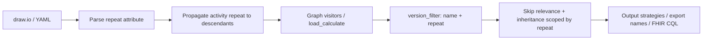

# Concept Repeat — Feature Specification

| Field | Value |
|-------|-------|
| **Status** | Implemented |
| **Branch target** | `feature/repeat` |
| **Authoring surface** | draw.io attributes + YAML fixtures for tests |

Valid status values: `Draft` → `Approved` → `Implemented` → `Superseded`.  
Implementation must not start until status is **`Approved`** (see `AGENTS.md`).

---

# Part I — Business Description

*Audience: clinical authors, guideline developers, implementers evaluating TRICC workflows.*

## 1. Overview

**Concept Repeat** lets authors collect the **same clinical concept more than once** during a single patient encounter — for example, temperature at triage and again after treatment — without inventing artificial concept codes like `temperature_2`.

Authors set an integer **`repeat`** on a question (or on an entire activity). Each repeat value acts as a **separate capture slot** for that concept. If a slot was already filled, TRICC skips asking again; if the repeat number is new, the question is shown.

## 2. Clinical problem

In many protocols the same measurement or finding is needed at different points in one visit. Today, TRICC treats every node with the same concept `name` as one shared data point:

- If the concept was already entered elsewhere in the flow, the question is **skipped**.
- Calculations that reference the concept **reuse** the earlier value.

That is correct when data should be collected once. It breaks down when the protocol genuinely needs **multiple independent readings** of the same concept in one encounter.

## 3. What changes for authors

### 3.1 Node-level `repeat`

On any data-capture node in draw.io, add:

```text
repeat=<integer>
```

| Situation | Author sets | User experience |
|-----------|-------------|-----------------|
| First capture of a concept (default) | omit `repeat`, or `repeat=1` | Question shown once per repeat slot 1 |
| Second independent capture | `repeat=2` on another node with the same `name` | Question shown again |
| Same slot revisited | same `name` and same `repeat` | Skipped if already answered (same as today) |

**Important:** `repeat` is set on the **question node** in the activity diagram, not on the concept definition in the data dictionary.

### 3.2 Activity-level `repeat`

On the **activity start** node:

```text
repeat=<integer>
```

Every data-input question inside that activity uses this repeat value. The activity setting **overrides** any `repeat` already set on individual questions — useful when a whole section belongs to one time point (e.g. “post-treatment assessment” = repeat 2).

Applies to: `integer`, `decimal`, `text`, `date`, `select_one`, `select_multiple`, `select_yesno`, and related capture nodes.

Does **not** apply to:

- **`input`** nodes — pre-loaded data from before or outside the current encounter.
- **`populate`** / initial-value patterns — FHIR pre-fill, not in-form capture.

For those pre-encounter sources, authors may set **`repeat=0`** on the node to **force in-form collection** even when a value already exists in the patient record.

### 3.3 What repeat does *not* do

- **No inheritance across repeats.** A value captured at `repeat=1` is not merged into logic at `repeat=2`.
- **No change to the concept code.** The FHIR/clinical `name` stays the same; only the capture slot differs.
- **Not the same as activity `instance`.** `instance` runs the whole activity tab again (e.g. a second wound in a repeat group). `repeat` is about multiple values for one concept within the encounter.

## 4. Examples

### 4.1 Two temperature readings

```text
Activity “Triage”:     integer  name=temperature  repeat=1  → 37.2 °C
Activity “Re-check”:   integer  name=temperature  repeat=2  → 36.8 °C
```

Both questions appear. Each value is stored independently.

### 4.2 Same repeat — second question skipped

```text
Activity A:  integer  name=weight  repeat=1  → 3.2 kg
Activity B:  integer  name=weight  repeat=1  → skipped (already captured in slot 1)
```

### 4.3 Whole activity at one time point

```text
activity_start  repeat=2
  integer  name=weight   repeat=1   → effective repeat=2 (activity wins)
  integer  name=height   (no repeat) → effective repeat=2
```

### 4.4 Existing diagrams (backward compatibility)

Diagrams **without** `repeat` behave exactly as today. Omitted `repeat` is treated as **`repeat=1`**, which matches current single-capture semantics.

## 5. Expressions and pre-filled data (CQL authors)

### 5.1 Default concept references

When authoring CQL or calculate expressions, a plain concept reference (e.g. `temperature`) resolves to the **latest captured version** for the default slot (`repeat=1`), preserving today’s behaviour.

### 5.2 Repeat-aware Helper functions (FHIR / OpenSRP)

Three new Helper functions are planned (exact names to align with FHIR CQL conventions):

| Function | Purpose |
|----------|---------|
| `GetRepeated(code, repeat)` | Value for a specific repeat slot |
| `GetNumberOfRepeat(code)` | How many repeat slots have been captured for this concept |
| `GetHistoryValue(code, period, reverseOrderPosition, repeatIndex)` | Nth most recent capture in window (`period` null = entire chart; see `feature/populate-context.md`) |

On FHIR export, repeat index is stored as an **extension on the Observation** (and related resources) so downstream systems can distinguish multiple readings of the same code.

## 6. Benefits

- **Faithful guidelines** — protocols with repeated measurements map directly to the diagram.
- **Cleaner data dictionary** — one concept code, multiple timed captures.
- **Predictable UX** — authors control when to re-ask vs skip, per slot.
- **Safe migration** — existing projects need no changes.

## 7. Limitations and open decisions

- Whether `repeat` applies to **diagnosis / proposed_diagnosis** nodes is not yet decided.
- Cross-activity behaviour: same `name` + same `repeat` in two activities will skip on the second (encounter-wide), matching current versioning — **proposed: keep this**.
- Final FHIR extension URL and Helper naming to be confirmed during implementation.

---

# Part II — Technical Specification

*Audience: TRICC developers and contributors. Do not implement until Part I is **Approved**.*

## 8. Formal semantics

### 8.1 Attribute definition

| Scope | Attribute | Model / stencil |
|-------|-----------|-----------------|
| Concept instance | `repeat: Optional[int]` | Nodes with `name` participating in capture/versioning |
| Activity | `repeat` on `activity_start` | Propagated to descendants at parse time |

- Stored on **TRICC nodes**, not on `CodeSystem.concept`.
- **Default:** `None` or omitted → **`1`** (`get_repeat(node) == 1`).
- **Special:** `repeat=0` — force in-form capture for `input` / populate-style nodes when pre-encounter data exists.
- **Versioning key:** `(name, repeat)` replaces `name` alone for `version_filter`, skip logic, and inheritance.

### 8.2 Activity propagation

When `activity_start.repeat = N`:

1. Walk all descendant capture nodes in the activity.
2. Set `node.repeat = N` (overwrite any node-level value; log at debug).
3. **Exclude** `TriccNodeInput` and populate/initial-expression nodes unless explicitly given `repeat=0` by the author.
4. Propagate to calculates / logic nodes that share a `name` used for capture, so versioning scope is consistent.

Implementation point: `xml_to_tricc.py` → `propagate_activity_repeat(activity)` after `get_activity_details`; mirror in `YamlStrategy`.

### 8.3 Distinction from `instance` and `version`

| Attribute | Where | Purpose | Export suffix |
|-----------|-------|---------|---------------|
| `instance` | `activity_start`, `goto`, `TriccNodeActivity` | Multiple runs of an activity tab | `_Ii_<n>` |
| `version` | Assigned at processing | Revisit of same `(name, repeat)` | `_Vv_<n>` |
| `repeat` | Node or `activity_start` | Multiple capture slots per concept | `_Rr_<n>` when `n != 1` |

### 8.4 Core helper

```python
def get_repeat(node) -> int:
    """Return effective repeat integer. Default 1; 0 is explicit force-capture."""
    value = getattr(node, "repeat", None)
    if value is None:
        return 1
    return int(value)
```

### 8.5 CQL / FHIR Helper additions

Extend the Helper library (`fhir_form.py` template / `FHIRcore.md`):

```cql
define function GetRepeated(code String, repeatIndex Integer):
  -- Observation with matching code and repeat extension = repeatIndex

define function GetNumberOfRepeat(code String):
  -- Count of distinct repeat slots captured for code

define function GetHistoryValue(code String, period String, reverseOrderPosition Integer, repeatIndex Integer):
  -- Nth most recent Observation for code (supersedes GetLast; see populate-context spec)
```

- Persist repeat index via **Observation extension** on export.
- Plain `GetObservation(code)` continues to return the latest value for `repeat=1` (backward compatible).
- Questionnaire `linkId`: disambiguate slots, e.g. `weight__Rr_2` when `repeat != 1`.

---

## 9. Processing pipeline



### 9.1 Visitor changes (`tricc_oo/visitors/tricc.py`)

| Function | Required change |
|----------|-----------------|
| `version_filter(name)` | Match `name` **and** `get_repeat(item) == get_repeat(node)` |
| `get_versions`, `get_last_version`, `set_last_version_false` | Use updated filter |
| `get_next_version` | Max version within `(name, repeat)` |
| `load_calculate` skip block (~L311–340) | `all_prev_versions` only same `repeat` |
| `get_version_inheritance` | Input set pre-filtered by repeat |
| `export_proposed_diags` / `export_diags` | Dedup by `(name, repeat)` if applicable |

### 9.2 Export names (`tricc_oo/converters/tricc_to_xls_form.py`)

Add `REPEAT_SEPARATOR = "_Rr_"`.

Suffix order when multiple apply: `name + _Rr_<repeat> + _Vv_<version>` (+ `_Ii_<instance>` for activity instances).

Apply suffix only when `get_repeat(node) != 1`.

---

## 10. Code changes checklist

### 10.1 Models

| File | Change |
|------|--------|
| `tricc_oo/models/base.py` | `repeat: Optional[int] = None` on `TriccNodeBaseModel` |
| `tricc_oo/models/tricc.py` | Copy `repeat` in `make_instance` |

### 10.2 Input parsing

| File | Change |
|------|--------|
| `tricc_oo/converters/drawio_type_map.py` | Add `repeat` to `activity_start`, input types, `calculate`, diagnoses; exclude or special-case `input` |
| `tricc_oo/converters/xml_to_tricc.py` | Parse `repeat`; `propagate_activity_repeat()`; validate integer ≥ 0 |
| `tricc_oo/strategies/input/yaml.py` | Add `repeat` to `NODE_TYPE_MAP`; activity propagation |

### 10.3 Core engine

| File | Change |
|------|--------|
| `tricc_oo/visitors/tricc.py` | `get_repeat`, scoped `version_filter`, grep `name ==` in versioning context |
| `tricc_oo/converters/tricc_to_xls_form.py` | `REPEAT_SEPARATOR`, `get_export_name` |

### 10.4 Output strategies

| File | Change |
|------|--------|
| `tricc_oo/serializers/xls_form.py` | Updated export names |
| `tricc_oo/strategies/output/xls_form.py` | Same |
| `tricc_oo/strategies/output/xlsform_cht.py` | Same |
| `tricc_oo/strategies/output/xlsform_cdss.py` | Same |
| `tricc_oo/strategies/output/fhir_form.py` | Repeat-aware `linkId`, Helper functions, Observation extension |
| `tricc_oo/converters/fhir/concept_mapper.py` | Repeat → FHIR extension mapping |
| `tricc_oo/converters/fhir/fsh_serializer.py` | Extension in generated FSH if needed |
| `tricc_oo/strategies/output/dhis2_form.py` | Disambiguated ids if applicable |

### 10.5 Authoring tools

| File | Change |
|------|--------|
| `tricc_oo/tools/TRICCS-Scratchpad.xml` | `repeat` user-defined attribute on relevant stencils |

### 10.6 Tests

| File | Change |
|------|--------|
| `tests/data/yaml/concept_repeat_basic.yaml` | Same/different repeat skip behaviour |
| `tests/data/yaml/concept_repeat_activity_inherit.yaml` | Activity override |
| `tests/data/yaml/concept_repeat_calculate_chain.yaml` | No cross-repeat merge |
| `tests/data/yaml/concept_repeat_input_force.yaml` | `repeat=0` on `input` forces capture |
| `tests/test_concept_repeat.py` | Unit tests for filter, propagation, export names |
| `tests/test_strategies/test_opensrp_strategy.py` | FHIR Helper + extension cases |

### 10.7 Documentation (post-implementation)

| File | Change |
|------|--------|
| `docs/tricc-elements.md` | `repeat` attribute reference |
| `docs/visual-authoring-concepts.md` | Authoring patterns |
| `docs/pipeline.md` | Repeat scoping in `load_calculate` |
| `docs/testing/transformation-test-coverage.md` | New test matrix rows |
| `docs/desing/FHIRcore.md` | Helper API + Observation extension |
| `docs/open-srp-export.md` | User guide for repeated capture |
| `docs/troubleshooting.md` | Skip / duplicate question FAQ |

---

## 11. Validation rules

1. `repeat` must be a non-negative integer when present.
2. Invalid values → parse warning or error (align with `instance` validation).
3. `repeat` on CodeSystem concept stencils → ignored with warning.
4. Activity `repeat` overrides node `repeat`; log at debug when overriding.

---

## 12. Test acceptance criteria

- [ ] Diagrams without `repeat` pass all existing inheritance tests unchanged.
- [ ] Same `name`, `repeat=1` then `repeat=2`: both inputs active (no cross-repeat skip).
- [ ] Same `name`, same `repeat`: second input skipped (matches current versioning).
- [ ] Activity `repeat=3` forces `repeat=3` on all in-scope descendants.
- [ ] `input` / populate nodes excluded from activity propagation; `repeat=0` forces capture.
- [ ] `get_export_name`: no `_Rr_` suffix when `repeat=1`; suffix when `repeat>=2`.
- [ ] FHIR: two repeat slots → two Questionnaire items; Observation carries repeat extension.
- [ ] No COALESCE / expression merge across different `repeat` values for the same `name`.
- [ ] `GetRepeated`, `GetNumberOfRepeat`, `GetHistoryValue` covered by CQL tests.

---

## 13. Implementation phases

| Phase | Scope | Deliverable |
|-------|-------|-------------|
| **1** | Models + parse + activity propagation | Round-trip attributes; propagation tests |
| **2** | Visitor versioning / skip logic | YAML regression fixtures |
| **3** | XLSForm / CHT / CDSS export names | `build.py` smoke tests |
| **4** | FHIR Helper + Questionnaire + extension | CQL / SDC tests per `FHIRcore.md` |
| **5** | Docs + scratchpad stencils | Author-facing docs; status → `Implemented` |

---

## 14. References (current codebase)

- Version filter / inheritance: `tricc_oo/visitors/tricc.py` — `version_filter`, `get_version_inheritance`, `load_calculate`
- Skip relevance: `has_node_data_operation` (~L380), block ~L311–340
- Export names: `tricc_oo/converters/tricc_to_xls_form.py` — `VERSION_SEPARATOR`, `INSTANCE_SEPARATOR`
- Attribute map: `tricc_oo/converters/drawio_type_map.py`
- Inheritance fixtures: `tests/data/yaml/inheritance_versioning_basic.yaml`
- Test matrix: `docs/testing/transformation-test-coverage.md`