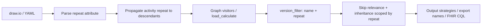

# Concept Repeat — Feature Specification

| Field | Value |
|-------|-------|
| **Status** | Implemented |
| **Branch target** | `feature/repeat` (core); evolutions on `feature/adv_merge_calc` |
| **Related** | `feature/advanced-merge-calc.md`, `feature/populate-context.md`, `feature/20260813-concepttype-structuremap.md` (Observation repeat-index on extract), `feature/20260821-get-repeated-value-operation.md` (`GetRepeatedValue` as an expression operation), `feature/20260825-get-repeated-value-latest.md` (optional slot = latest this consultation) |
| **Authoring surface** | draw.io attributes + YAML fixtures for tests |

Valid status values: `Draft` → `Approved` → `Implemented` → `Superseded`.

---

# Part I — Business Description

*Audience: clinical authors, guideline developers, implementers evaluating TRICC workflows.*

## 1. Overview

**Concept Repeat** lets authors collect the **same clinical concept more than once** during a single patient encounter — for example, temperature at triage and again after treatment — without inventing artificial concept codes like `temperature_2`.

Authors set an integer **`repeat`** on a question (or on an entire activity). Each repeat value acts as a **separate capture slot** for that concept. If a slot was already filled, TRICC skips asking again; if the repeat number is new, the question is shown.

## 2. Clinical problem

In many protocols the same measurement or finding is needed at different points in one visit. Today, TRICC treats every node with the same concept `name` as one shared data point:

- If the concept was already entered elsewhere in the flow, the question is **skipped**.
- Calculations that reference the concept **reuse** the earlier value.

That is correct when data should be collected once. It breaks down when the protocol genuinely needs **multiple independent readings** of the same concept in one encounter.

## 3. What changes for authors

### 3.1 Node-level `repeat`

On any data-capture node in draw.io, add:

```text
repeat=<integer>
```

| Situation | Author sets | User experience |
|-----------|-------------|-----------------|
| First capture of a concept (default) | omit `repeat`, or `repeat=1` | Question shown once per repeat slot 1 |
| Second independent capture | `repeat=2` on another node with the same `name` | Question shown again |
| Same slot revisited | same `name` and same `repeat` | Skipped if already answered (same as today) |

**Important:** `repeat` is set on the **question node** in the activity diagram, not on the concept definition in the data dictionary.

### 3.2 Activity-level `repeat`

On the **activity start** node:

```text
repeat=<integer>
```

Every data-input question inside that activity uses this repeat value. The activity setting **overrides** any `repeat` already set on individual questions — useful when a whole section belongs to one time point (e.g. “post-treatment assessment” = repeat 2).

Applies to: `integer`, `decimal`, `text`, `date`, `select_one`, `select_multiple`, `select_yesno`, and related capture nodes.

Does **not** apply to:

- **`input`** nodes — pre-loaded data from before or outside the current encounter.
- **`populate`** / initial-value patterns — FHIR pre-fill, not in-form capture.

For those pre-encounter sources, authors may set **`repeat=0`** on the node to **force in-form collection** even when a value already exists in the patient record.

### 3.3 Local-only slot (`repeat=-1`)

Authors may set **`repeat=-1`** for a **local-only** capture of a concept:

| Behaviour | Detail |
|-----------|--------|
| Addressable | Expressions can still reference the node by `name` |
| No inheritance in | The node does **not** receive values from prior same-name versions |
| No inheritance out | The node does **not** contribute its value to other nodes’ multi-version merges (`GET_INHERITED_VALUE`) |
| Export name | No `_Rr_` suffix (same base as default `repeat=1`); uniqueness via `_Vv_n` in a shared export pool with `repeat <= 1` |

Use when an activity needs a temporary or private copy of a concept that must not participate in encounter-wide value inheritance. See also `feature/advanced-merge-calc.md`.

### 3.4 What repeat does *not* do

- **No inheritance across positive repeats.** A value captured at `repeat=1` is not merged into logic at `repeat=2`.
- **No change to the concept code.** The FHIR/clinical `name` stays the same; only the capture slot differs.
- **Not the same as activity `instance`.** `instance` runs the whole activity tab again (e.g. a second wound in a repeat group). `repeat` is about multiple values for one concept within the encounter.
- **`repeat=-1` is not a “history” index** — history look-ups use populate `context=history` / `GetHistoryValue` (see `feature/populate-context.md`).

## 4. Examples

### 4.1 Two temperature readings

```text
Activity “Triage”:     integer  name=temperature  repeat=1  → 37.2 °C
Activity “Re-check”:   integer  name=temperature  repeat=2  → 36.8 °C
```

Both questions appear. Each value is stored independently.

### 4.2 Same repeat — second question skipped

```text
Activity A:  integer  name=weight  repeat=1  → 3.2 kg
Activity B:  integer  name=weight  repeat=1  → skipped (already captured in slot 1)
```

### 4.3 Whole activity at one time point

```text
activity_start  repeat=2
  integer  name=weight   repeat=1   → effective repeat=2 (activity wins)
  integer  name=height   (no repeat) → effective repeat=2
```

### 4.4 Local-only weight (no inheritance)

```text
Activity A:  integer  name=weight  repeat=1     → 3.2 kg (encounter slot)
Activity B:  integer  name=weight  repeat=-1    → asked again; does not inherit 3.2
                                              → later nodes do not coalesce B into slot 1
```

### 4.5 Existing diagrams (backward compatibility)

Diagrams **without** `repeat` behave exactly as today. Omitted `repeat` is treated as **`repeat=1`**, which matches current single-capture semantics.

## 5. Expressions and pre-filled data (CQL authors)

### 5.1 Default concept references

When authoring calculate expressions, a plain concept reference (e.g. `temperature`) resolves within the matching **repeat slot**. Multi-version display fields in the same slot may be wrapped in `GET_INHERITED_VALUE` so any filled instance is used (see `feature/advanced-merge-calc.md`).

### 5.2 Repeat-aware Helper functions (FHIR / OpenSRP)

Implemented Helper functions (see `repeat_helper.py`, `populate_helper.py`, and `feature/populate-context.md`):

| Function | Purpose |
|----------|---------|
| `GetRepeated` / `GetRepeatedValue` | Resource / scalar for a specific within-form repeat slot. `GetRepeatedValue` is also a TRICC operation usable in any expression and supported on the XLSForm/CHT path — see `feature/20260821-get-repeated-value-operation.md` |
| `GetNumberOfRepeat(code)` | How many repeat slots have been captured for this concept |
| `GetHistory` / `GetHistoryValue` | Chart history (resource / scalar); supersedes former `GetLast` / `GetLastValue` |

On FHIR export, non-default repeat index is stored as a **Questionnaire item extension** and StructureMap/Observation hints so downstream systems can distinguish multiple readings of the same code.

## 6. Benefits

- **Faithful guidelines** — protocols with repeated measurements map directly to the diagram.
- **Cleaner data dictionary** — one concept code, multiple timed captures.
- **Predictable UX** — authors control when to re-ask vs skip, per slot.
- **Local isolation** — `repeat=-1` for private copies without global inheritance.
- **Safe migration** — existing projects need no changes.

## 7. Limitations and resolved decisions

| Topic | Decision |
|-------|----------|
| Cross-activity same `(name, repeat)` | Skip on second capture (encounter-wide) — **kept** |
| FHIR extension URL | `https://fhir.tricc.io/StructureDefinition/questionnaire-concept-repeat` |
| History helpers | `GetHistoryValue` (not `GetLast`) — see populate-context |
| `repeat` on diagnosis / proposed_diagnosis | Still open; not required for core capture path. Observation repeat-index on extract is in `feature/20260813-concepttype-structuremap.md` |

---

# Part II — Technical Specification

*Audience: TRICC developers and contributors. Status: **Implemented** (core + `repeat=-1` + FHIR helpers).*

## 8. Formal semantics

### 8.1 Attribute definition

| Scope | Attribute | Model / stencil |
|-------|-----------|-----------------|
| Concept instance | `repeat: Optional[int]` | Nodes with `name` participating in capture/versioning |
| Activity | `repeat` on `activity_start` | Propagated to descendants at parse time |

- Stored on **TRICC nodes**, not on `CodeSystem.concept`.
- **Default:** `None` or omitted → **`1`** (`get_repeat(node) == 1`).
- **Special:** `repeat=0` — force in-form capture for `input` / populate-style nodes when pre-encounter data exists.
- **Special:** `repeat=-1` — local-only: versioning/export peers with `repeat <= 1`, but **excluded** from value inheritance sources and receivers (`_filter_inheritable_versions`, early return in `get_version_inheritance`).
- **Versioning key:** `(name, repeat)` for `version_filter`, skip logic, and inheritance scoping.
- **Export pool key:** `(name, repeat)` when `repeat > 1`; else `(name, "<=1")` so default and `-1` share `_Vv_` renumbering without `_Rr_`.

### 8.2 Activity propagation

When `activity_start.repeat = N`:

1. Walk all descendant capture nodes in the activity.
2. Set `node.repeat = N` (overwrite any node-level value; log at debug).
3. **Exclude** `TriccNodeInput` and populate/initial-expression nodes unless explicitly given `repeat=0` by the author.
4. Propagate to calculates / logic nodes that share a `name` used for capture, so versioning scope is consistent.

Implementation point: `xml_to_tricc.py` → `propagate_activity_repeat(activity)` after `get_activity_details`; mirror in `YamlStrategy`.

### 8.3 Distinction from `instance` and `version`

| Attribute | Where | Purpose | Export suffix |
|-----------|-------|---------|---------------|
| `instance` | `activity_start`, `goto`, `TriccNodeActivity` | Multiple runs of an activity tab | `_Ii_<n>` |
| `version` | Assigned at processing | Revisit of same export base | `_Vv_<n>` |
| `repeat` | Node or `activity_start` | Multiple capture slots per concept | `_Rr_<n>` only when `n > 1` |

### 8.4 Core helper

```python
def get_repeat(node) -> int:
    """Return effective repeat integer. Default 1; 0 is explicit force-capture."""
    value = getattr(node, "repeat", None)
    if value is None:
        return 1
    return int(value)
```

### 8.5 CQL / FHIR Helper additions

Extend the Helper library (`fhir_form.py` template / `FHIRcore.md`):

```cql
define function GetRepeated(code String, repeatIndex Integer):
  -- Observation with matching code and repeat extension = repeatIndex

define function GetRepeatedValue(code String, repeatIndex Integer):
  -- Scalar value for slot

define function GetNumberOfRepeat(code String):
  -- Count of distinct repeat slots captured for code

define function GetHistoryValue(code String, period String, reverseOrderPosition Integer, repeatIndex Integer):
  -- Nth most recent Observation for code (see feature/populate-context.md; replaces GetLast)
```

- Questionnaire item extension for non-default repeat (URL in §7).
- Plain observation accessors continue to return the latest value for `repeat=1` (backward compatible).
- Export / `linkId` disambiguation uses `_Rr_<n>` when `repeat > 1`.

---

## 9. Processing pipeline



### 9.1 Visitor changes (`tricc_oo/visitors/tricc.py`)

| Function | Required change |
|----------|-----------------|
| `version_filter(name, repeat)` | Match `name` **and** optional `get_repeat(item) == repeat` (includes `-1`) |
| `get_versions`, `get_last_version` | Scoped by `(name, repeat)` |
| `set_last_version_false` | Export-name peers: `repeat > 1` isolated; `repeat <= 1` (incl. `-1`) share pool |
| `load_calculate` skip / inheritance | `all_prev_versions` only same `repeat`; then `get_version_inheritance` |
| `get_version_inheritance` | Skip receiver when `repeat=-1`; drop prior `-1` from operands; multi-version merge (see advanced-merge-calc) |
| `export_proposed_diags` / `export_diags` | Dedup by `(name, repeat)` if applicable |

### 9.2 Export names (`tricc_oo/converters/tricc_to_xls_form.py`)

`REPEAT_SEPARATOR = "_Rr_"`.

Suffix order when multiple apply: `name + _Rr_<repeat> + _Vv_<version>` (+ `_Ii_<instance>` for activity instances).

Apply `_Rr_` suffix **only when `get_repeat(node) > 1`** (not for `0` or `-1`).

---

## 10. Code changes checklist

### 10.1 Models

| File | Change |
|------|--------|
| `tricc_oo/models/base.py` | `repeat: Optional[int] = None` on `TriccNodeBaseModel` |
| `tricc_oo/models/tricc.py` | Copy `repeat` in `make_instance` |

### 10.2 Input parsing

| File | Change |
|------|--------|
| `tricc_oo/converters/drawio_type_map.py` | Add `repeat` to `activity_start`, input types, `calculate`, diagnoses; exclude or special-case `input` |
| `tricc_oo/converters/xml_to_tricc.py` | Parse `repeat`; `propagate_activity_repeat()`; validate integer ≥ 0 |
| `tricc_oo/strategies/input/yaml.py` | Add `repeat` to `NODE_TYPE_MAP`; activity propagation |

### 10.3 Core engine

| File | Change |
|------|--------|
| `tricc_oo/visitors/tricc.py` | `get_repeat`, scoped `version_filter`, grep `name ==` in versioning context |
| `tricc_oo/converters/tricc_to_xls_form.py` | `REPEAT_SEPARATOR`, `get_export_name` |

### 10.4 Output strategies

| File | Change |
|------|--------|
| `tricc_oo/serializers/xls_form.py` | Updated export names |
| `tricc_oo/strategies/output/xls_form.py` | Same |
| `tricc_oo/strategies/output/xlsform_cht.py` | Same |
| `tricc_oo/strategies/output/xlsform_cdss.py` | Same |
| `tricc_oo/strategies/output/fhir_form.py` | Repeat-aware `linkId`, Helper functions, Observation extension |
| `tricc_oo/converters/fhir/concept_mapper.py` | Repeat → FHIR extension mapping |
| `tricc_oo/converters/fhir/fsh_serializer.py` | Extension in generated FSH if needed |
| `tricc_oo/strategies/output/dhis2_form.py` | Disambiguated ids if applicable |

### 10.5 Authoring tools

| File | Change |
|------|--------|
| `tricc_oo/tools/TRICCS-Scratchpad.xml` | `repeat` user-defined attribute on relevant stencils |

### 10.6 Tests

| File | Change |
|------|--------|
| `tests/data/yaml/concept_repeat_basic.yaml` | Same/different repeat skip behaviour |
| `tests/data/yaml/concept_repeat_activity_inherit.yaml` | Activity override |
| `tests/data/yaml/concept_repeat_calculate_chain.yaml` | No cross-repeat merge |
| `tests/data/yaml/concept_repeat_input_force.yaml` | `repeat=0` on `input` forces capture |
| `tests/test_concept_repeat.py` | Unit tests for filter, propagation, export names |
| `tests/test_strategies/test_opensrp_strategy.py` | FHIR Helper + extension cases |

### 10.7 Documentation (post-implementation)

| File | Change |
|------|--------|
| `docs/tricc-elements.md` | `repeat` attribute reference |
| `docs/visual-authoring-concepts.md` | Authoring patterns |
| `docs/pipeline.md` | Repeat scoping in `load_calculate` |
| `docs/testing/transformation-test-coverage.md` | New test matrix rows |
| `docs/desing/FHIRcore.md` | Helper API + Observation extension |
| `docs/open-srp-export.md` | User guide for repeated capture |
| `docs/troubleshooting.md` | Skip / duplicate question FAQ |

---

## 11. Validation rules

1. `repeat` must be a non-negative integer when present.
2. Invalid values → parse warning or error (align with `instance` validation).
3. `repeat` on CodeSystem concept stencils → ignored with warning.
4. Activity `repeat` overrides node `repeat`; log at debug when overriding.

---

## 12. Test acceptance criteria

- [x] Diagrams without `repeat` pass all existing inheritance tests unchanged.
- [x] Same `name`, `repeat=1` then `repeat=2`: both inputs active (no cross-repeat skip).
- [x] Same `name`, same `repeat`: second input gets skip relevance (matches current versioning).
- [x] Activity `repeat=3` forces `repeat=3` on all in-scope descendants.
- [x] `get_export_name`: no `_Rr_` when `repeat<=1` (incl. `0`, `-1`); suffix when `repeat>=2`.
- [x] No COALESCE / expression merge across different `repeat` values for the same `name`.
- [x] `repeat=-1` resolvable by reference; excluded from inheritance source/receiver.
- [x] Export pool renumbers `repeat=-1` with default slot peers for unique `_Vv_` names.
- [x] FHIR: repeat Helper CQL + Questionnaire extension (`tests/test_fhir_repeat.py`).
- [ ] Full activity propagation exclusion matrix for `input` / populate + `repeat=0` force-capture (partial; see populate-context tests).
- [ ] Scratchpad stencil attribute coverage for all capture types (optional tooling follow-up).

---

## 13. Implementation phases

| Phase | Scope | Status |
|-------|-------|--------|
| **1** | Models + parse + activity propagation | Done |
| **2** | Visitor versioning / skip logic + `repeat=-1` | Done |
| **3** | XLSForm / CHT export names | Done |
| **4** | FHIR Helper + Questionnaire extension | Done (core) |
| **5** | Docs + advanced merge interaction | Done (this branch) |

---

## 14. References (current codebase)

- Version filter / inheritance: `tricc_oo/visitors/tricc.py` — `version_filter`, `get_version_inheritance`, `set_last_version_false`, `load_calculate`, `_filter_inheritable_versions`
- Multi-version merge: `feature/advanced-merge-calc.md`
- Export names: `tricc_oo/converters/tricc_to_xls_form.py` — `REPEAT_SEPARATOR`, `VERSION_SEPARATOR`, `INSTANCE_SEPARATOR`
- Attribute map: `tricc_oo/converters/drawio_type_map.py`
- Tests: `tests/test_concept_repeat.py`, `tests/test_fhir_repeat.py`, `tests/data/yaml/concept_repeat_activity_inherit.yaml`
- Test matrix: `docs/testing/transformation-test-coverage.md`