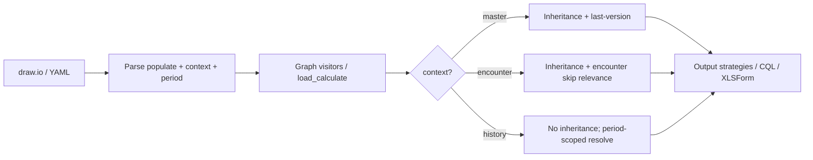

# Populate — Feature Specification

| Field | Value |
|-------|-------|
| **Status** | Implemented |
| **Branch target** | `develop` |
| **Related** | `feature/concept-repeat.md` |
| **Authoring surface** | draw.io attributes + YAML fixtures |

Valid status values: `Draft` → `Approved` → `Implemented` → `Superseded`.  
Implementation must not start until status is **`Approved`** (see `AGENTS.md`).

---

# Part I — Business Description

*Audience: clinical authors, guideline developers, implementers evaluating TRICC workflows.*

## 1. Overview

**Populate** nodes load **existing clinical data** into a form or calculation — patient demographics, facility context, values already captured in this encounter, or historical readings — without asking the user again when the data is already known.

Populate is a **single node type** (`odk_type="populate"`). Authors declare:

- **what** to fetch — `name` / `reference` (concept code);
- **where to look** — `context`;
- **how far back** (when relevant) — `period`.

Populate nodes are **non-display calculates**: they participate in the graph sequence and expressions but do not render as user-facing questions.

## 2. Clinical problem

CDSS forms routinely need data from several scopes:

| Source | Example |
|--------|---------|
| Patient record | Age, sex, chronic conditions |
| Facility / site | Facility code, district |
| Current visit | Weight already entered at triage |
| Prior chart | Last blood pressure in the past 14 days |

Without populate, authors duplicate questions or embed fragile expression workarounds. A first-class populate node with an explicit **context** makes pre-fill, skip logic, and export predictable across XLSForm, CHT, CDSS, and FHIR.

## 3. Populate node

```text
odk_type="populate"
name=<concept_code>
context=<context_value>
period=<ISO_period>   # optional; see §3.2
repeat=<integer>      # optional; see §3.3
```

### 3.1 Context values

| `context` | Meaning | Typical use | Update semantics |
|-----------|---------|-------------|------------------|
| `patient` | Stable patient-level value | Name, DOB, HIV status | Update in place |
| `facility` | Facility / site context | Facility ID, district (CHT HF) | Update in place |
| `practitioner` | Current user / CHW | Practitioner ID | Update in place |
| `location` | Geographic / service location | Village, catchment area | Update in place |
| `encounter` | Current encounter only | Value already captured this visit | Skip if known in encounter (`skip_or_new`) |
| `history` | Longitudinal / charted data | Prior BP, prior weight | New chart entry on capture; read within `period` |

**Master-record contexts** (`patient`, `facility`, `practitioner`, `location`): one current value per concept; inheritance and last-version logic apply.

**Encounter**: scoped to the **current encounter**. If the concept was already captured in this visit, populate pre-fills and downstream capture nodes may skip. An optional `period` may further narrow the search within the encounter timeline (edge case; see §3.2).

**History**: reads the best matching value inside a configured time window (`period`). Each new in-form capture of the same concept may create a separate chart entry. Populate does not by itself suppress new questions unless the protocol defines skip logic.

### 3.2 Period attribute (`period`)

Optional time window using ISO 8601 **Duration** or **Period**. Meaning depends on `context`.

| Context | `period` | Default when omitted |
|---------|----------|----------------------|
| `patient`, `facility`, `practitioner`, `location` | Not used (ignored if present) | — |
| `encounter` | Optional — narrows lookup within the current encounter | **None** (full encounter scope) |
| `history` | Recommended — bounds cross-encounter search | **`P1Y`** + conversion warning |

Examples:

```text
period=P14D      # last 14 days
period=P1M       # last month
period=P1Y       # last year
period=2024-01-01/2024-12-31   # explicit Period (start/end)
```

When `context=history` and `period` is omitted, default to **`P1Y`** and emit a conversion warning.  
When `context=encounter` and `period` is omitted, search the **entire current encounter** — no default is applied.

### 3.3 Interaction with concept repeat

See `feature/concept-repeat.md` for capture-slot semantics. Populate-specific rules:

- Populate is **excluded** from `activity_start.repeat` propagation.
- Optional `repeat` on populate selects **which capture slot to read** when data is repeat-indexed (default: `1`).
- `repeat=0` on populate means **do not satisfy skip from pre-loaded data** — force in-form collection for that concept.

Populate reads data; it does not create repeat slots.

## 4. Authoring examples

### 4.1 Patient age

```text
populate  name=p_age_year  context=patient  label="Patient age"
```

### 4.2 Facility code

```text
populate  name=facility_id  context=facility
```

### 4.3 Weight from triage (same encounter)

```text
populate  name=weight  context=encounter
```

A later activity pre-fills `weight` if triage already captured it.

### 4.4 Blood pressure in the past 14 days

```text
populate  name=bp_systolic  context=history  period=P14D
```

Returns the most recent matching value inside the window.

### 4.5 Repeat-aware encounter read

```text
populate  name=temperature  context=encounter  repeat=2
```

Reads the encounter value for repeat slot 2.

### 4.6 Encounter value within a time window (edge case)

```text
populate  name=weight  context=encounter  period=PT4H
```

Reads `weight` from the current encounter only if captured within the last four hours. Uncommon; use `history` for look-back across visits.

## 5. Behaviour matrix (normative)

| `context` | Inheritance / last-version | Skip if already in encounter | New chart row on write | Expression resolution |
|-----------|---------------------------|------------------------------|------------------------|----------------------|
| `patient`, `facility`, `practitioner`, `location` | Yes | N/A (pre-encounter) | Update in place | Context-aware accessor |
| `encounter` | Yes | Yes (`skip_or_new`) | Update in encounter | Context-aware accessor; optional `period` narrows within encounter |
| `history` | No | No | Always new on capture | Accessor uses `period` (default `P1Y` if omitted) |

## 6. Benefits

- One stencil and one attribute model for all pre-loaded data.
- Natural mapping to FHIR search scopes and SDC `initialExpression` / Helper CQL.
- Compatible with concept repeat without conflating populate with capture nodes.
- Consistent export across XLSForm, CHT, CDSS, and FHIR.

## 7. Export targets (normative)

Populate `context` drives how each output strategy resolves pre-loaded values.

### 7.1 FHIR / OpenSRP

FHIR export **requires** a shared **Helper** CQL library with context-specific accessor functions (one thin form library + rich Helper, per `docs/desing/FHIRcore.md`):

| `context` | Helper function (required) |
|-----------|---------------------------|
| `patient` | `GetPatientValue(code)` |
| `facility` | `GetFacilityValue(code)` |
| `location` | `GetLocationValue(code)` |
| `practitioner` | `GetPractitionerValue(code)` |
| `encounter` | `GetEncounterValue(code, repeatIndex, period)` — `period` optional (`null` = full encounter) |
| `history` | `GetHistoryValue(code, period, reverseOrderPosition, repeatIndex)` — see §7.1.1 |

Populate nodes map to hidden Questionnaire items with SDC `initialExpression` referencing simple define names that delegate to the Helper.

#### 7.1.1 `GetHistoryValue` replaces `GetLast`

`GetHistoryValue` is the **single canonical author-facing Helper** for longitudinal / chart look-ups. It **supersedes** `GetLast` and `GetLastValue` from `feature/concept-repeat.md` (currently in `repeat_helper.py`).

| Parameter | Meaning | Default |
|-----------|---------|---------|
| `period` | ISO window bounding `effective` date | `P1Y` for `context=history` populate; `null` = no window (entire chart) |
| `reverseOrderPosition` | Nth most recent match in the filtered set (`1` = latest) | `1` |
| `repeatIndex` | Filter to a specific concept-repeat slot (`Observation` repeat extension) | `null` = any slot |

#### 7.1.2 Authoring vs generated CQL (naming)

Two layers — do not expose FHIR structure to diagram authors:

| Layer | Function | Returns | `.value` in expressions? |
|-------|----------|---------|--------------------------|
| **Authoring** (draw.io, YAML, calculate labels) | `GetHistoryValue(…)` | Clinical scalar | **No** — authors never write `.value` |
| **Generated Helper CQL** (FHIR export only) | `GetHistory(…)` | FHIR resource (e.g. Observation) | **Yes** — `GetHistoryValue` is implemented as `GetHistory(…).value` |

Convention: Helper names ending in **`Value`** (`GetPatientValue`, `GetEncounterValue`, `GetHistoryValue`, …) return **scalars** suitable for authoring and Questionnaire `initialExpression`. Resource-level names without the `Value` suffix (`GetHistory`, `GetObservation`, …) exist only in **generated CQL** and must **not** be parsed or accepted in **input strategies** (`xml_to_tricc.py`, `YamlStrategy`, expression visitors).

Migration from concept-repeat helpers (authoring layer):

| Former | Replacement |
|--------|-------------|
| `GetLast(code, n)` | `GetHistoryValue(code, null, n, null)` |
| `GetLastValue(code, n)` | `GetHistoryValue(code, null, n, null)` |
| `populate` `context=history` | `GetHistoryValue(code, period, 1, repeatIndex)` — `period` resolved at parse; `repeatIndex` from populate `repeat` when set |

**Retained** (not replaced): `GetRepeated`, `GetRepeatedValue`, `GetNumberOfRepeat` — these address **within-encounter / within-form repeat slots**, not period-scoped chart history.

At populate implementation, update `repeat_helper.py`, `feature/concept-repeat.md`, and `docs/desing/FHIRcore.md` to remove `GetLast` / `GetLastValue` in favour of `GetHistory` + `GetHistoryValue`.

### 7.2 CHT (Community Health Toolkit)

CHT wiring depends on `context` and on whether the form is opened from the **contact profile** or as a **task** continuation.

| `context` | CHT data source | Form binding |
|-----------|-----------------|--------------|
| `patient`, `facility`, `location` | **Contact summary** — built-in contact/lineage fields or keys added to `context` | `instance('contact-summary')/context/<key>` |
| `practitioner`, `encounter`, `history` | **Task** (when the form is task-triggered) **or** **contact-summary extension** (when not) | Task: values injected into form `content` via `tasks.js` / `*Content` handler; otherwise same `contact-summary` instance path |

**Contact-summary contexts** (`patient`, `facility`, `location`): stable values exposed on the contact profile. TRICC export emits calculate bindings against `instance('contact-summary')/context/<key>`. Deployment must ensure the CHT `contact-summary.templated.js` (and its helper modules) populate those keys — from contact fields, lineage, or project-specific logic.

**Extended contexts** (`practitioner`, `encounter`, `history`): values that depend on the current user, the active visit, or report history.

- **Task-triggered forms** (follow-up / continuation): use the existing CHT task pattern — a `*Content(contact, report)` function injects fields from the triggering report via `injectDataFromForm` (see `tricc_oo/visitors/xform_pd.py` task scaffold). TRICC may emit task JS stubs listing required concept codes.
- **Non-task forms**: extend the contact summary via **`contact-summary.templated.js`** helper modules (same pattern as `cht-chad`: `contact-summary-extras.js`, `contact-summary-cpn.js`, etc.) — JS functions scan `reports`, apply `period` filtering for `history`, and write keys into the exported `context` object consumed by `instance('contact-summary')/context/<key>`.

`encounter` populate on a task chain typically reads from the **triggering report** (same visit). `history` populate in contact-summary helpers scans prior reports within the configured `period`.

### 7.3 Remaining open decisions

- Exact `<key>` naming convention in contact-summary `context` (plain concept code vs prefixed, e.g. `cpn_p_faf`).
- Auto-generation scope for CHT `contact-summary` / `tasks.js` scaffolds vs deployer-authored JS only.


---

# Part II — Technical Specification

*Audience: TRICC developers. Do not implement until Part I is **Approved**.*

## 8. Formal model

### 8.1 Node class

```python
class TriccNodePopulate(TriccNodeFakeCalculateBase):
    """Pre-loaded data node (non-display calculate)."""
    tricc_type: TriccNodeType = TriccNodeType.populate

    context: str = "patient"
    period: Optional[str] = None
    data_type: Optional[str] = None
    concept_type: Optional[str] = None
    repeat: Optional[int] = None
    is_sequence_defined: bool = False
```

- `name` / `reference`: concept code to resolve.
- `TriccPeriod`: parses and validates `period` (ISO Duration; extend for Period `start/end`).

### 8.2 Enum and draw.io mapping

| Item | Decision |
|------|----------|
| `TriccNodeType.populate` | Primary enum value |

`drawio_type_map.py`:

```python
TriccNodeType.populate: {
    "objects": ["UserObject", "object"],
    "attributes": [
        "save", "reference", "data_type", "concept_type",
        "context", "period", "repeat",
    ],
    "mandatory_attributes": ["name", "label"],
    "model": TriccNodePopulate,
}
```

### 8.3 Context validation

```python
MASTER_CONTEXTS = {"patient", "facility", "practitioner", "location"}
ENCOUNTER_CONTEXT = "encounter"
HISTORY_CONTEXT = "history"
ALLOWED_CONTEXTS = MASTER_CONTEXTS | {ENCOUNTER_CONTEXT, HISTORY_CONTEXT}
```

| Rule | Action |
|------|--------|
| `context` not in `ALLOWED_CONTEXTS` | `logger.error`; default `patient` |
| `period` set and `context in MASTER_CONTEXTS` | `logger.warning`; ignore `period` |
| `context == encounter` and `period` empty | no default — full encounter scope |
| `context == history` and `period` empty | default **`P1Y`** + warning |
| `period` unparseable | `logger.error`; treat as no window |

## 9. Processing pipeline



### 9.1 Visitor changes (`tricc_oo/visitors/tricc.py`)

| Area | Change |
|------|--------|
| `get_version_inheritance` | Skip when `context == history` |
| `load_calculate` skip / relevance | Last-version relevance for `context in MASTER_CONTEXTS ∪ {encounter}` only |
| `version_filter` / repeat | Populate uses `(name, repeat)` when `repeat` set; excluded from activity propagation |
| `is_ready_to_process` | Treat `TriccNodePopulate` as `TriccNodeFakeCalculateBase` |
| Expression resolution | `resolve_populate_reference(node)` keyed by `context`, `period`, `repeat` |

### 9.2 Expression resolution

Author-facing accessors always use `*Value` helpers (scalars, no `.value` suffix in authored text).

```python
def resolve_populate_reference(node: TriccNodePopulate) -> str:
    """Return author-facing export accessor for a populate node."""
    # patient      → GetPatientValue(code)
    # facility     → GetFacilityValue(code)
    # location     → GetLocationValue(code)
    # practitioner → GetPractitionerValue(code)
    # encounter    → GetEncounterValue(code, repeatIndex, period=None)
    # history      → GetHistoryValue(code, period, 1, repeatIndex)  # replaces GetLast / GetLastValue
    # CHT          → contact-summary context path or task content field (§10.2)
```

**Input strategy rule:** `GetHistory` (and other resource-level Helper names without the `Value` suffix) must **not** be recognized in draw.io / YAML expression parsing. If an author needs chart history, they use `populate` with `context=history` or an explicit `GetHistoryValue(…)` in export-bound calculate output — never `GetHistory(…)` or `….value` in the authoring surface.

### 9.3 Concept repeat integration

| Rule | Implementation |
|------|----------------|
| Activity `repeat` propagation | Skip `TriccNodePopulate` |
| `get_repeat(node)` on populate | Read-slot selection only |
| `repeat=0` | Populate does not satisfy skip; capture nodes still shown |

## 10. Output strategies

### 10.1 FHIR / OpenSRP (`FHIRStrategy`)

FHIR export **must** emit a Helper CQL library (extend `repeat_helper.py` or add `populate_helper.py`) with **all** context accessors below. Per-process libraries stay thin; populate `initialExpression` uses simple define names only.

```cql
define function GetPatientValue(code String):
  -- Patient resource / related person data by concept code

define function GetFacilityValue(code String):
  -- Organization / site context

define function GetLocationValue(code String):
  -- Location / service area

define function GetPractitionerValue(code String):
  -- Practitioner / user context for current session

define function GetEncounterValue(code String, repeatIndex Integer, period String):
  -- current Encounter, repeat-aware; period null → full encounter scope

define function GetHistory(
  code String,
  period String,
  reverseOrderPosition Integer,
  repeatIndex Integer
):
  -- Returns FHIR resource (e.g. Observation); generated CQL only — not an authoring construct

define function GetHistoryValue(
  code String,
  period String,
  reverseOrderPosition Integer,
  repeatIndex Integer
):
  GetHistory(code, period, reverseOrderPosition, repeatIndex).value
  -- Author-facing scalar; replaces GetLast / GetLastValue
```

| Export artefact | Rule |
|---------------|------|
| Helper library | `*Value` functions return scalars for Questionnaire / thin libs; resource helpers (`GetHistory`, …) are implementation detail |
| Helper library | `GetHistoryValue` supersedes `GetLast` / `GetLastValue` (remove from `repeat_helper.py`) |
| Helper library | `GetHistoryValue` receives resolved `period` (`P1Y` default applied at parse for populate `history`) |
| Input strategies | Do not parse `GetHistory` or `.value` in draw.io / YAML expressions (§9.2) |
| Per-segment / form library | Thin `define` aliases delegating to Helper |
| Questionnaire item | Hidden item; `initialExpression` = simple define name |
| `resolve_populate_reference` | Maps `context` → correct Helper function + arguments (`period`, `repeat`) |

### 10.2 XLSForm / CHT (`XLSFormCHTStrategy`, `XLSFormCHTHFStrategy`)

#### Binding model

| `context` group | XLSForm calculate expression | CHT runtime source |
|-----------------|------------------------------|-------------------|
| `patient`, `facility`, `location` | `instance('contact-summary')/context/<key>` | Contact summary `context` (built-in or extended) |
| `practitioner`, `encounter`, `history` (task form) | Field pre-filled from task `content` | `tasks.js` `*Content` + `injectDataFromForm` from triggering `report` |
| `practitioner`, `encounter`, `history` (non-task) | `instance('contact-summary')/context/<key>` | `contact-summary.templated.js` helper module |

Reference implementation pattern: **`cht-chad`** (`../cht-chad` relative to TRICC repo):

- `contact-summary.templated.js` — template exporting `fields`, `cards`, `context`.
- `contact-summary-extras.js` — shared helpers; card `modifyContext` callbacks (e.g. `generateChildContext`) write report-derived keys into `context`.
- `contact-summary-cpn.js` / `contact-summary-cpon.js` — `injectDataFromForm(ctx, '<prefix>', CASE_DATA, FORMS, reports)` to expose prior-form values.
- Form XML binds: `calculate="…instance('contact-summary')/context/<key>…"`.
- Task continuation: `imci-task.js` / `xform_pd.get_task_js()` — `injectDataFromForm(content, …, [report])` for encounter-scoped pre-fill.

#### TRICC export responsibilities

| Output | Content |
|--------|---------|
| XLSForm survey row | Hidden `calculate` for each populate node |
| `contact-summary` instance | `<instance id="contact-summary"/>` in form XML (CHT standard) |
| Calculate expression | Context-appropriate path per table above |
| Optional scaffolds | Lists of context keys for contact-summary JS and/or task JS (reuse `xform_pd.get_tasksstrings` pattern) |
| `history` + `period` | Document required JS filter (`reported_date` within ISO window) in scaffold comments |

`load.<concept>` export names (current `TriccNodeInput` pattern) apply only where the strategy explicitly maps master-record populate to legacy `load.` bindings; prefer `contact-summary` context paths for CHT.

### 10.3 CDSS

Calculate-only (no survey row); references appear in relevance / constraints via `resolve_populate_reference`.

## 11. Code changes checklist

### 11.1 Models

| File | Change |
|------|--------|
| `tricc_oo/models/base.py` | `TriccNodeType.populate` |
| `tricc_oo/models/calculate.py` | `TriccNodePopulate`, `TriccPeriod` parser |

### 11.2 Input parsing

| File | Change |
|------|--------|
| `tricc_oo/converters/drawio_type_map.py` | `populate` entry |
| `tricc_oo/converters/xml_to_tricc.py` | Parse `context`, `period`, `repeat`; validate |
| `tricc_oo/strategies/input/yaml.py` | `populate` in `NODE_TYPE_MAP` |

### 11.3 Visitors & export

| File | Change |
|------|--------|
| `tricc_oo/visitors/tricc.py` | Context-aware inheritance, skip, `resolve_populate_reference` |
| `tricc_oo/converters/tricc_to_xls_form.py` | Populate calculate lines; CHT `contact-summary` bindings by `context` |
| `tricc_oo/converters/fhir/populate_helper.py` (or extend `repeat_helper.py`) | Required Helper CQL: all six `Get*Value` functions |
| `tricc_oo/strategies/output/fhir_form.py` | `TriccNodePopulate` in CQL operand resolution |
| `tricc_oo/strategies/output/xlsform_cdss.py` | Populate calculate lines |
| `tricc_oo/visitors/xform_pd.py` | Task JS scaffold for task-triggered populate (`encounter` / `history` / `practitioner`) |
| CHT deploy artefacts (documented / optional scaffold) | `contact-summary.templated.js` helper stubs listing required `context` keys |

### 11.4 Tests

| Test | Purpose |
|------|---------|
| `tests/test_populate_context.py` | Context validation, inheritance rules, expression resolution |
| `tests/data/yaml/populate_*.yaml` | `patient`, `encounter`, `history` fixtures |

### 11.5 Documentation

| File | Change |
|------|--------|
| `docs/tricc-elements.md` | Populate section + context table |
| `docs/desing/FHIRcore.md` | Helper CQL for populate contexts |
| `feature/concept-repeat.md` | Cross-link populate + repeat interaction |

## 12. Acceptance criteria

- [x] `TriccNodePopulate` with `context` and optional `period` / `repeat`.
- [x] `context` ∈ {patient, facility, practitioner, location, encounter, history} enforced at parse.
- [x] `period` on `encounter` (optional, no default) and `history` (default `P1Y`); ignored on master contexts; ISO duration and Period start/end parse correctly.
- [x] `encounter` participates in skip / last-version logic; `history` does not.
- [x] Expressions use `resolve_populate_reference` (context + period + repeat).
- [x] Populate excluded from activity `repeat` propagation; `repeat` on populate selects read slot.
- [x] FHIR export: `GetHistory` (resource) + `GetHistoryValue` (scalar via `.value` in CQL only); replaces `GetLast` / `GetLastValue`.
- [ ] Input strategies reject or ignore resource-level Helper names (`GetHistory`, …) and `.value` in authored expressions.
- [x] CHT export: `patient` / `facility` / `location` → `instance('contact-summary')/context/<key>`; extended contexts use same binding pattern.
- [x] Unit and YAML fixture tests for all contexts.
- [x] User-facing docs updated (`docs/tricc-elements.md`, `docs/desing/FHIRcore.md`).

## 13. Implementation phases

| Phase | Scope |
|-------|--------|
| **1 — Model & parse** | `TriccNodePopulate`, draw.io / YAML, validation |
| **2 — Visitors** | Inheritance, skip, `resolve_populate_reference` |
| **3 — Export** | XLSForm, CHT bindings/scaffolds, CDSS, FHIR Helper CQL (all six accessors) |
| **4 — Tests & docs** | Fixtures, acceptance tests, documentation |